<h1 align="center">Do Local à Nuvem: Projeto BIA com Docker, WSL 2 e AWS</h1>

<p align="center">
  <strong>Desafio 1 — Formação AWS 5.0</strong><br>
  Um passo a passo completo e reproduzível: do notebook zerado até a aplicação rodando na AWS.
</p>

<p align="center">
  
  
  
  
  
</p>

<p align="center">
  
  
  
  
  
</p>

---

> ### Como usar este documento
>
> Ele foi escrito para ser **seguido de cima para baixo**, mesmo por quem nunca usou Docker ou AWS.
> São **22 etapas numeradas em sequência única**. Cada etapa tem a mesma estrutura:
>
> - **O que vamos fazer** — a explicação em uma frase, sem jargão
> - **Os comandos** — prontos para copiar e colar
> - **Como saber que deu certo** — a validação antes de seguir adiante
>
> Nunca pule a validação. Se ela falhar, o problema está *nessa* etapa — e não três etapas à frente.
> Foi exatamente assim que este laboratório foi construído: uma camada de cada vez.

---

## Índice

- [O desafio](#-o-desafio)
- [Roadmap da solução](#-roadmap-da-solução)
- [Resultado](#-resultado)
- [Arquitetura](#-arquitetura)
- [Pré-requisitos](#-pré-requisitos)
- **[Parte 1 — Ambiente local](#parte-1--ambiente-local)**
  - [1. Validar o Windows e o estado atual](#1-validar-o-windows-e-o-estado-atual)
  - [2. Instalar o Ubuntu 24.04 no WSL 2](#2-instalar-o-ubuntu-2404-no-wsl-2)
  - [3. Limitar os recursos do WSL](#3-limitar-os-recursos-do-wsl)
  - [4. Instalar e configurar o Git no Ubuntu](#4-instalar-e-configurar-o-git-no-ubuntu)
  - [5. Autenticar no GitHub via SSH](#5-autenticar-no-github-via-ssh)
  - [6. Conectar o VS Code ao WSL](#6-conectar-o-vs-code-ao-wsl)
  - [7. Integrar o Docker Desktop ao WSL 2](#7-integrar-o-docker-desktop-ao-wsl-2)
  - [8. Smoke test do Docker Compose](#8-smoke-test-do-docker-compose)
  - [9. Subir o projeto BIA](#9-subir-o-projeto-bia)
  - [10. Rodar as migrations do banco](#10-rodar-as-migrations-do-banco)
  - [11. Conectar o DBeaver ao banco](#11-conectar-o-dbeaver-ao-banco)
  - [12. Provar a persistência dos dados](#12-provar-a-persistência-dos-dados)
- **[Parte 2 — Levando para a AWS](#parte-2--levando-para-a-aws)**
  - [13. Conta, Free Tier e Budget](#13-conta-free-tier-e-budget)
  - [14. CloudShell e definição da região](#14-cloudshell-e-definição-da-região)
  - [15. Criar os Security Groups](#15-criar-os-security-groups)
  - [16. Criar a IAM Role de acesso ao SSM](#16-criar-a-iam-role-de-acesso-ao-ssm)
  - [17. Provisionar o RDS PostgreSQL](#17-provisionar-o-rds-postgresql)
  - [18. Lançar a instância EC2](#18-lançar-a-instância-ec2)
  - [19. Conectar na EC2 via SSM Session Manager](#19-conectar-na-ec2-via-ssm-session-manager)
  - [20. Fazer o deploy da BIA na EC2](#20-fazer-o-deploy-da-bia-na-ec2)
  - [21. Validar o resultado na nuvem](#21-validar-o-resultado-na-nuvem)
  - [22. Destruir o laboratório](#22-destruir-o-laboratório)
- [Solução de problemas](#-solução-de-problemas)
- [Provas de execução](#-provas-de-execução)
- [Checklist de entrega](#-checklist-de-entrega)
- [O que aprendi](#-o-que-aprendi)
- **[Apêndice — Fundamentos de Git e Docker](#-apêndice--fundamentos-de-git-e-docker)**
  - [A. O problema que Git e Docker resolvem](#a-o-problema-que-git-e-docker-resolvem)
  - [B. As três áreas do Git](#b-as-três-áreas-do-git)
  - [C. Ignorar arquivos e guardar trabalho pela metade](#c-ignorar-arquivos-e-guardar-trabalho-pela-metade)
  - [D. Sincronizando com o GitHub](#d-sincronizando-com-o-github)
  - [E. Branches, merge e Pull Request](#e-branches-merge-e-pull-request)
  - [F. Referência rápida do Git](#f-referência-rápida-do-git)
  - [G. Container não é máquina virtual](#g-container-não-é-máquina-virtual)
  - [H. Dockerfile — a receita](#h-dockerfile--a-receita)
  - [I. Build — da receita à imagem](#i-build--da-receita-à-imagem)
  - [J. Run — da imagem ao container](#j-run--da-imagem-ao-container)
  - [K. Compose — orquestrando vários serviços](#k-compose--orquestrando-vários-serviços)
  - [L. Onde ficam as imagens](#l-onde-ficam-as-imagens)
  - [M. Rodar o Docker sem sudo](#m-rodar-o-docker-sem-sudo)
  - [N. Limpeza do ambiente](#n-limpeza-do-ambiente)
  - [O. O fluxo mental completo](#o-o-fluxo-mental-completo)
  - [P. Checklist de validação](#p-checklist-de-validação)
- [Créditos e referências](#-créditos-e-referências)

---

## 🎯 O desafio

**O problema:** montar do zero um ambiente de desenvolvimento completo e colocar o projeto **BIA**
(Node.js + React + PostgreSQL) para rodar localmente com Docker — **persistindo os dados** e com o
banco acessível de fora pelo **DBeaver**.

**A etapa extra:** publicar a mesma aplicação em uma instância **EC2** na AWS, usando **RDS** como
banco gerenciado e acessando a máquina **sem abrir a porta 22**.

**O que se prova ao final:**

| Prova | Como fica evidente |
| --- | --- |
| A aplicação roda localmente | `http://localhost:3001` responde no navegador do Windows |
| Os dados persistem | A tarefa cadastrada sobrevive a um `docker compose down` seguido de `up` |
| O banco é acessível externamente | O DBeaver conecta na porta `5433` e enxerga a tabela `Tarefas` |
| A mesma stack roda na nuvem | `http://<IP-PÚBLICO-DA-EC2>:3001` responde, gravando no RDS |
| O acesso é seguro | Nenhuma porta 22 aberta, nenhuma chave `.pem` — só IAM e SSM |

> 💡 **A ideia central do desafio:** a aplicação **não muda**. O que muda é a infraestrutura embaixo
> dela. O contrato `container → porta → banco` é idêntico nos dois ambientes.

---

## 🗺️ Roadmap da solução

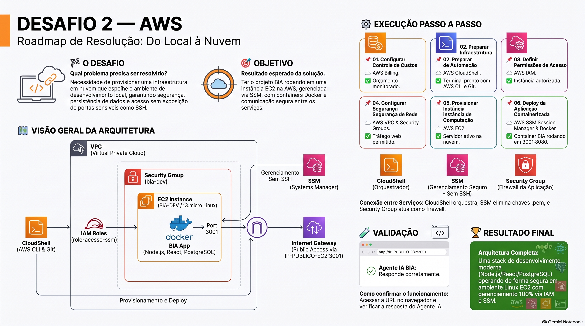

| | Parte 1 — Ambiente local (etapas 1–12) | Parte 2 — AWS (etapas 13–22) |
| :-: | --- | --- |
| **Objetivo** | Fazer a BIA rodar no notebook, com os dados persistidos | Publicar a mesma stack na nuvem, com segurança e custo controlado |
| **Ferramentas** | WSL 2, Ubuntu, Git, VS Code, Docker Desktop, DBeaver | Console AWS, CloudShell, IAM, EC2, RDS, Systems Manager |
| **Termina quando** | A tarefa cadastrada sobrevive ao restart dos containers | A aplicação responde pelo IP público — e o laboratório é destruído |

---

## 📸 Resultado

A mesma aplicação, nos dois ambientes:

| Local — `localhost:3001` | AWS — EC2 `bia-dev` na porta `3001` |
| :---: | :---: |
| 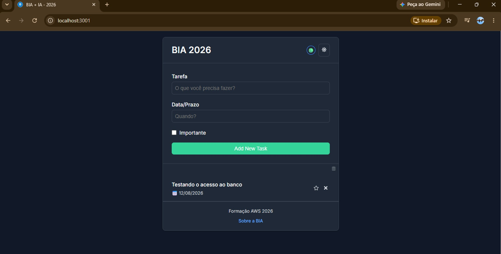 | 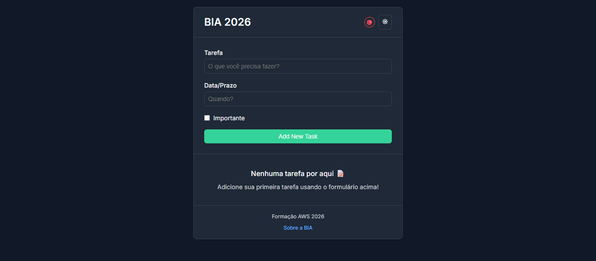 |
| Registro gravado no PostgreSQL do container e mantido após reiniciar o ambiente | Mesma imagem da aplicação servida a partir da instância EC2 na região `us-east-1` |

---

## 🏗️ Arquitetura

### Visão geral: local × nuvem

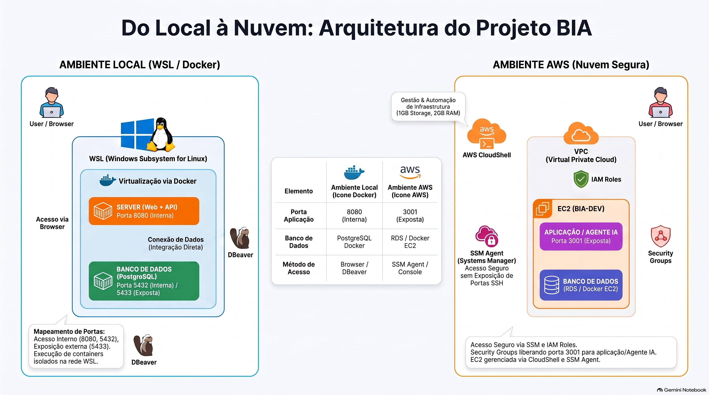

| Elemento | Ambiente local (Docker) | Ambiente AWS |
| --- | --- | --- |
| Porta da aplicação | `8080` interna, exposta em `3001` | `3001` exposta pelo Security Group |
| Banco de dados | PostgreSQL em container (`5432` → `5433`) | **RDS PostgreSQL** gerenciado |
| Rede | Rede bridge do Docker dentro do WSL 2 | VPC com Security Groups `bia-dev` e `bia-db` |
| Método de acesso | Browser + DBeaver via `localhost` | Browser + **SSM Session Manager** / Console |
| Provisionamento | `docker compose up -d` | Console AWS + CloudShell (AWS CLI) |

### Arquitetura local (WSL 2 / Docker)

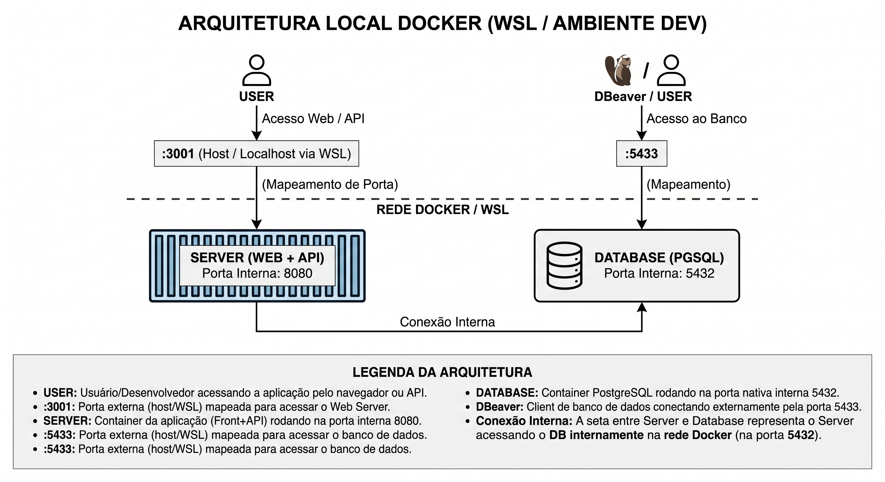

| Componente | Porta interna | Porta no host (WSL) | Papel |
| --- | :---: | :---: | --- |
| **SERVER** (`bia`) | `8080` | `3001` | Container da aplicação — front-end React + API Node.js |
| **DATABASE** (`postgres:17.1`) | `5432` | `5433` | PostgreSQL com os dados da aplicação |
| **REDIS** (`valkey:8.1-alpine`) | `6379` | `6379` | Cache da aplicação |
| **DBeaver** | — | conecta em `5433` | Client de banco rodando no Windows |

### Arquitetura na AWS

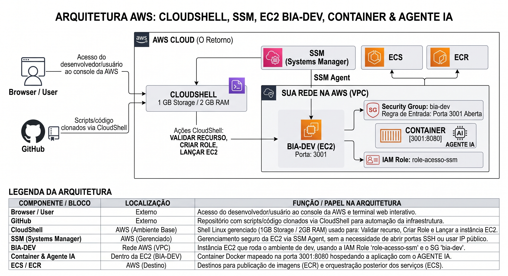

| Componente | Localização | Função na arquitetura |
| --- | --- | --- |
| **Browser / User** | Externo | Acesso ao console da AWS e à aplicação publicada |
| **CloudShell** | AWS (ambiente base) | Shell Linux gerenciado, já com `aws cli`, `git`, `python` e `node` |
| **SSM (Systems Manager)** | AWS (gerenciado) | Acesso administrativo à EC2 — **sem porta 22 e sem key pair** |
| **EC2 `bia-dev`** | VPC | Instância `t3.micro` (`us-east-1a`) que executa o container da aplicação |
| **Security Group `bia-dev`** | VPC | Libera a porta `3001` para a internet |
| **Security Group `bia-db`** | VPC | Libera a porta `5432` **apenas** para o Security Group da EC2 |
| **IAM Role `role-acesso-ssm`** | IAM | Autoriza a instância a conversar com o Systems Manager |
| **RDS PostgreSQL** | VPC | Banco relacional gerenciado consumido pela aplicação na EC2 |

> A escolha por **SSM Session Manager no lugar de SSH** é o que mais muda a forma de pensar acesso a
> instâncias: não existe porta 22 aberta, não existe chave privada para vazar, e todo acesso passa
> por IAM — auditável e revogável.

---

## 🧰 Pré-requisitos

### O que instalar no Windows antes de começar

| Software | Para quê | Onde obter |
| --- | --- | --- |
| **Docker Desktop** | Fornece o engine que roda os containers | <https://www.docker.com/products/docker-desktop/> |
| **VS Code** | Editor, conectado ao Linux pela extensão WSL | <https://code.visualstudio.com/> |
| **DBeaver Community** | Cliente para acessar o banco de dados | <https://dbeaver.io/download/> |
| **Conta na AWS** | Necessária apenas a partir da etapa 13 | <https://aws.amazon.com/free/> |

O WSL 2, o Ubuntu e o Git são instalados durante o passo a passo (etapas 2 e 4).

### Ambiente de referência

Este laboratório foi executado em um notebook modesto — e isso influenciou cada decisão de
arquitetura. Se a sua máquina for mais forte, tudo aqui continua valendo; você só terá mais folga.

| Hardware | Especificação |
| --- | --- |
| Notebook | Dell Inspiron 14 3000 |
| Processador | Intel Core i3-4005U @ 1.70 GHz — 2 núcleos / 4 threads |
| Memória | 8 GB DDR3 |
| Sistema | Windows 11 Pro 24H2 |

| Stack | Versão |
| --- | --- |
| WSL | 2.7.11.0 |
| Ubuntu | 24.04.4 LTS |
| Git | 2.43.0 |
| Docker Desktop | 4.86.0 |
| Docker Engine | 29.7.2 |
| Docker Compose | v5.3.1 |

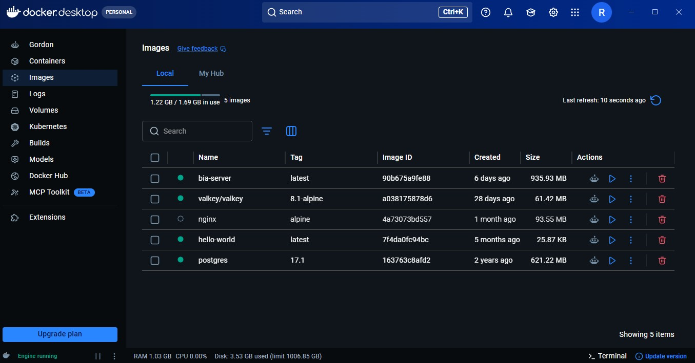

### Por que WSL 2 e não uma máquina virtual

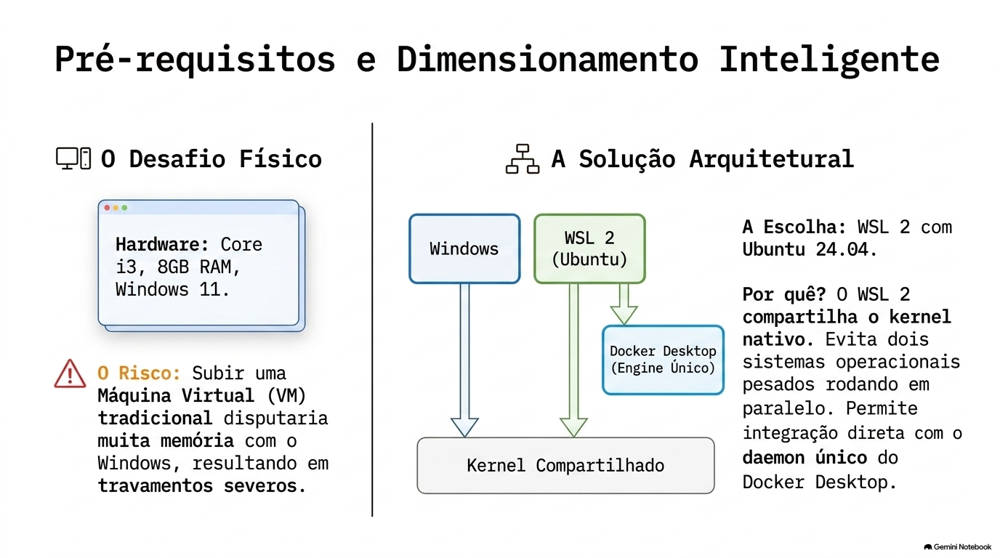

A instrução original do curso sugere montar uma VM para o treinamento. Com 8 GB de RAM e um i3 de
2 núcleos, subir um sistema operacional completo no VirtualBox significaria manter dois sistemas
operacionais disputando a mesma memória:

```text
VirtualBox                          WSL 2
Windows                             Windows
  └── VM Ubuntu (SO completo)         └── Ubuntu (kernel compartilhado)
        └── Docker Engine                   └── Docker CLI
                                                  └── Docker Desktop (engine único)
```

Optei pelo WSL 2 e **limitei explicitamente seus recursos** (etapa 3), deixando ~5 GB para Windows,
navegador, VS Code e Docker Desktop. O resultado é um ambiente Linux real, com Docker nativo, que
não derruba a máquina hospedeira.

O mesmo raciocínio vale para o Docker: **não** instale `docker.io` dentro do Ubuntu. O Docker
Desktop já fornece o engine, e a integração com o WSL apenas expõe a CLI dentro da distribuição —
um daemon, não dois.

---

# Parte 1 — Ambiente local

> A ordem importa: cada camada é validada antes de a próxima ser instalada.

---

### 1. Validar o Windows e o estado atual

**O que vamos fazer:** conferir se a sua máquina já tem o que precisamos, antes de instalar
qualquer coisa. Reinstalar o que já funciona costuma criar mais problema do que resolve.

Abra o **PowerShell** como usuário normal:

```powershell
winver          # confirmar Windows 10/11 com suporte a WSL 2
wsl --status    # versão padrão do WSL e distro default
wsl --version   # versão do WSL, kernel e WSLg
docker version  # verificar se o Docker Desktop já está instalado
```

**Como saber que deu certo:** o `winver` mostra Windows 10 (2004+) ou Windows 11, e o `wsl --version`
retorna uma versão do WSL.

> 💡 Se o `docker version` retornar erro de conexão com a API, normalmente significa apenas que o
> **Docker Desktop não está em execução** — não que a instalação esteja quebrada. Abra o Docker
> Desktop pelo menu Iniciar e repita.

---

### 2. Instalar o Ubuntu 24.04 no WSL 2

**O que vamos fazer:** instalar uma distribuição Linux de uso geral. Se você já tem o Docker
Desktop, existe uma distro chamada `docker-desktop` — ela é interna do Docker e **não** serve para
trabalhar.

```powershell
wsl --list --online     # distribuições disponíveis
wsl --list --verbose    # o que já está instalado
wsl --install Ubuntu-24.04
```

Na primeira execução o Ubuntu pede um usuário e uma senha UNIX.

> ⚠️ Ao digitar a senha no Linux **nada aparece na tela** — nem asteriscos. Isso é o comportamento
> esperado. Digite e pressione Enter.

**Como saber que deu certo:** dentro do Ubuntu, estes comandos devem responder:

```bash
uname -a
cat /etc/os-release
free -h
nproc
```

E, de volta no PowerShell, a distro precisa aparecer em **VERSION 2**:

```powershell
wsl --list --verbose
```

```text
  NAME              STATE           VERSION
* Ubuntu-24.04      Running         2
  docker-desktop    Stopped         2
```

---

### 3. Limitar os recursos do WSL

**O que vamos fazer:** dizer ao WSL quanta memória e CPU ele pode consumir. Por padrão ele toma
bem mais do que um notebook de 8 GB pode ceder — este é o passo que torna o laboratório viável.

```powershell
notepad "$env:USERPROFILE\.wslconfig"
```

O Bloco de Notas abre vazio. Cole exatamente isto e salve:

```ini
[wsl2]
memory=3GB
processors=2
swap=1GB
localhostForwarding=true

[experimental]
autoMemoryReclaim=gradual
```

| Parâmetro | Efeito |
| --- | --- |
| `memory=3GB` | Teto de RAM do WSL — impede que o Ubuntu sufoque o Windows |
| `processors=2` | 2 das 4 threads para o WSL, mantendo o host responsivo |
| `swap=1GB` | Proteção contra estouro de memória (mais lento que RAM, mas evita travar) |
| `localhostForwarding=true` | **Essencial aqui**: faz `localhost:3001` do Windows chegar no container dentro do WSL |
| `autoMemoryReclaim=gradual` | Devolve ao Windows a memória que o WSL deixou de usar |

O arquivo só passa a valer depois de reiniciar o WSL por completo:

```powershell
wsl --shutdown
wsl -d Ubuntu-24.04
```

**Como saber que deu certo:** dentro do Ubuntu,

```bash
free -h    # esperado: ~3.0Gi em Mem e 1.0Gi em Swap
nproc      # esperado: 2
```

---

### 4. Instalar e configurar o Git no Ubuntu

**O que vamos fazer:** instalar o Git **dentro do Ubuntu**, não no Windows. É o Git do Linux que
vai clonar os projetos e conversar com o Docker.

```bash
sudo apt update
sudo apt upgrade -y
sudo apt install git -y
git --version
```

Configure a identidade que aparecerá nos seus commits:

```bash
git config --global user.name "Seu Nome"
git config --global user.email "seu.email@exemplo.com"
git config --global --list
```

**Como saber que deu certo:** `git --version` retorna `git version 2.x.x` e o `--list` mostra o
`user.name` e o `user.email` que você acabou de definir.

---

### 5. Autenticar no GitHub via SSH

**O que vamos fazer:** criar um par de chaves e cadastrar a **pública** no GitHub, para clonar e
enviar código sem digitar senha toda hora.

```bash
ls -la ~/.ssh                                     # verificar se já existe uma chave
ssh-keygen -t ed25519 -C "seu.email@exemplo.com"  # Enter para aceitar o caminho padrão
```

Recomendo definir uma **passphrase** para a chave. Em seguida, carregue-a no agente:

```bash
eval "$(ssh-agent -s)"
ssh-add ~/.ssh/id_ed25519
```

Copie **apenas a chave pública**:

```bash
cat ~/.ssh/id_ed25519.pub
```

No GitHub: **Settings → SSH and GPG keys → New SSH key**, tipo *Authentication Key*. Cole o
conteúdo e salve.

**Como saber que deu certo:**

```bash
ssh -T git@github.com
```

```text
Hi <seu-usuario>! You've successfully authenticated, but GitHub does not provide shell access.
```

> ⚠️ `id_ed25519` é a **chave privada** e nunca deve ser compartilhada, commitada ou colada em
> documentação. Apenas o arquivo terminado em `.pub` vai para o GitHub.

---

### 6. Conectar o VS Code ao WSL

**O que vamos fazer:** usar a interface gráfica do VS Code no Windows, mas com o código, o
terminal e as ferramentas rodando dentro do Ubuntu.

Primeiro, os pré-requisitos do VS Code Server dentro do Ubuntu:

```bash
sudo apt install wget ca-certificates -y
dpkg -l ca-certificates | grep '^ii'
wget -q --spider https://update.code.visualstudio.com && echo $?   # esperado: 0
```

No VS Code (Windows): `Ctrl + Shift + X` → instalar a extensão **WSL (Microsoft)** →
`Ctrl + Shift + P` → **WSL: Connect to WSL**.

Crie a estrutura de trabalho dentro do Linux:

```bash
mkdir -p ~/projetos ~/repos ~/laboratorios-aws
```

**Como saber que deu certo:** o canto inferior esquerdo do VS Code exibe `WSL: Ubuntu-24.04`, e o
terminal integrado responde `/home/seu-usuario` ao comando `pwd`.

> ⚠️ Mantenha os projetos em `/home/usuario/...` e **não** em `/mnt/c/Users/...`. Trabalhar no
> filesystem montado do Windows degrada bastante a performance de Git, Docker e ferramentas Linux.

---

### 7. Integrar o Docker Desktop ao WSL 2

**O que vamos fazer:** liberar o comando `docker` dentro do Ubuntu, aproveitando o engine que o
Docker Desktop já roda no Windows.

> ⚠️ **Não** execute `sudo apt install docker.io` nem `docker-ce` dentro do Ubuntu. Isso cria um
> segundo daemon Docker, concorrente com o do Docker Desktop e caro demais para 8 GB de RAM.

No Docker Desktop: **Settings → Resources → WSL Integration** → marcar
`Enable integration with my default WSL distro` e a distro **`Ubuntu-24.04`** → **Apply & Restart**.

Reinicie a distribuição para carregar a integração:

```powershell
wsl --terminate Ubuntu-24.04
wsl -d Ubuntu-24.04
```

**Como saber que deu certo:** dentro do Ubuntu, o importante é aparecerem **Client e Server** —
se só aparecer o Client, a integração não foi aplicada.

```bash
docker version
docker info
docker context ls
docker run hello-world
```

---

### 8. Smoke test do Docker Compose

**O que vamos fazer:** um teste mínimo, com um container leve, para confirmar o mapeamento de
portas de ponta a ponta antes de subir a aplicação real.

```bash
mkdir -p ~/laboratorios-aws/docker-hello && cd ~/laboratorios-aws/docker-hello
nano compose.yaml
```

Conteúdo do arquivo:

```yaml
services:
  web:
    image: nginx:alpine
    ports:
      - "8080:80"
```

Salve com `Ctrl + O`, `Enter`, `Ctrl + X`. Depois:

```bash
docker compose up -d
docker compose ps
curl http://localhost:8080
docker compose down
```

**Como saber que deu certo:** o `curl` devolve o HTML padrão do Nginx (`<title>Welcome to
nginx!</title>`). Se isso funciona, o caminho Windows → WSL → Docker → container está inteiro.

---

### 9. Subir o projeto BIA

**O que vamos fazer:** clonar a aplicação e subir os três containers — aplicação, banco e cache.

```bash
cd ~/laboratorios-aws
git clone https://github.com/henrylle/bia
cd bia
docker compose up -d
```

> 💡 **Na primeira vez isso demora.** O serviço `server` é definido com `build: .`, então o Docker
> baixa a imagem do Node 24 e compila o front-end antes de subir. Em um i3 são vários minutos.
> Acompanhe o progresso com `docker compose logs -f server` (saia com `Ctrl + C`).

**Como saber que deu certo:**

```bash
docker compose ps
```

```text
NAME       IMAGE                      SERVICE    STATUS          PORTS
bia        bia-server                 server     Up 9 seconds    0.0.0.0:3001->8080/tcp
database   postgres:17.1              database   Up 12 seconds   0.0.0.0:5433->5432/tcp
redis      valkey/valkey:8.1-alpine   redis      Up 12 seconds   0.0.0.0:6379->6379/tcp
```

*(saída resumida — o comando real também traz as colunas `COMMAND` e `CREATED`, e repete cada porta
na forma IPv6 `[::]:3001->8080/tcp`.)*

Se preferir validar sem abrir o navegador, a API responde a versão:

```bash
curl http://localhost:3001/api/versao
```

```text
Bia 4.3.0
```

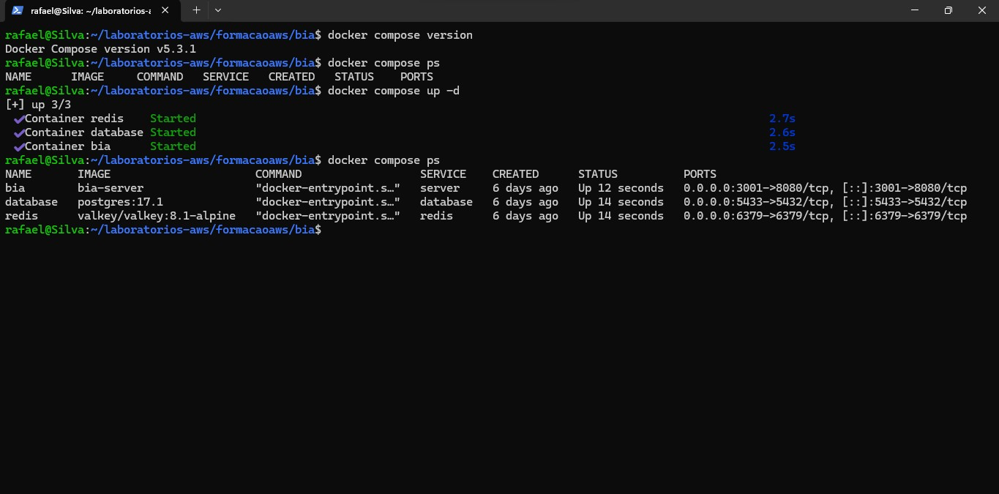

Abra **<http://localhost:3001>** no navegador do Windows — graças ao `localhostForwarding=true` da
etapa 3, a porta publicada dentro do WSL responde direto no host.

#### Entendendo o mapeamento de portas

Este é o conceito que separa "copiei o comando" de "entendi a rede":

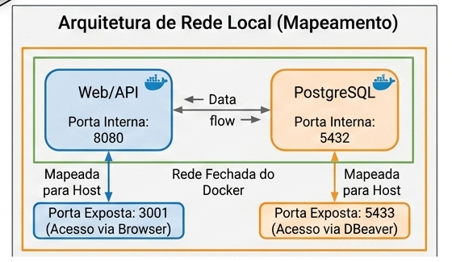

- **A aplicação não usa a porta `5433`.** O container `server` fala com o `database` pela rede
  interna do Docker, na porta nativa `5432`, resolvendo o nome do serviço (`DB_HOST=database`).
- **A `5433` existe apenas para o DBeaver** acessar o banco de fora — e foi escolhida justamente
  para não colidir com uma eventual instalação de PostgreSQL no Windows.
- Em `3001:8080`, o número da **esquerda é o host** e o da **direita é o container**.

---

### 10. Rodar as migrations do banco

**O que vamos fazer:** criar as tabelas da aplicação. O container do PostgreSQL sobe com o banco
`bia` vazio — as tabelas são criadas por um comando à parte.

> ⚠️ **Esta etapa não é opcional.** Sem ela a tabela `Tarefas` não existe e o cadastro na tela
> falha — justamente o teste que o desafio pede para comprovar a persistência.

```bash
docker compose exec server bash -c 'npx sequelize db:migrate'
```

**Como saber que deu certo:** a saída termina com a migration aplicada:

```text
Sequelize CLI [Node: 24.18.0, CLI: 6.6.5, ORM: 6.37.0]

Loaded configuration file "config/database.js".
== 20210924000838-criar-tarefas: migrating =======
== 20210924000838-criar-tarefas: migrated (0.130s)
```

> 💡 Se você rodar o comando uma segunda vez, a resposta será
> `No migrations were executed, database schema was already up to date.` — sinal de que o banco já
> está no estado correto, não de erro.

**Prova de execução** — as duas tabelas passam a existir no banco:

```bash
docker compose exec database psql -U postgres -d bia -c '\dt'
```

```text
             List of relations
 Schema |     Name      | Type  |  Owner
--------+---------------+-------+----------
 public | SequelizeMeta | table | postgres
 public | Tarefas       | table | postgres
(2 rows)
```

`Tarefas` guarda os dados da aplicação; `SequelizeMeta` é o controle interno de quais migrations já
rodaram — é ela que faz a segunda execução do comando não repetir nada.

Agora abra **<http://localhost:3001>** e cadastre uma tarefa. Ela deve aparecer na lista.


---

### 11. Conectar o DBeaver ao banco

**O que vamos fazer:** acessar o banco de dados do container a partir do Windows, provando que ele
está exposto para ferramentas externas.

Com o container `database` no ar, crie uma conexão **PostgreSQL** no DBeaver:

| Campo | Valor |
| --- | --- |
| Host | `localhost` |
| Porta | `5433` |
| Database | `bia` |
| Usuário | `postgres` |
| Senha | `postgres` |

> 💡 Esses valores vêm do arquivo `compose.yml` do projeto BIA (variáveis `POSTGRES_USER`,
> `POSTGRES_PASSWORD` e `POSTGRES_DB`). São credenciais de **desenvolvimento local** — nunca use
> um par `postgres/postgres` em qualquer ambiente exposto à internet.

Use **Test Connection** antes de salvar.

**Como saber que deu certo:** navegando em `bia → Esquemas → public → Tabelas` (ou
`Schemas → Tables`, se a sua interface estiver em inglês), a tabela **`Tarefas`** aparece, e a tarefa
que você cadastrou na etapa 10 está lá dentro.

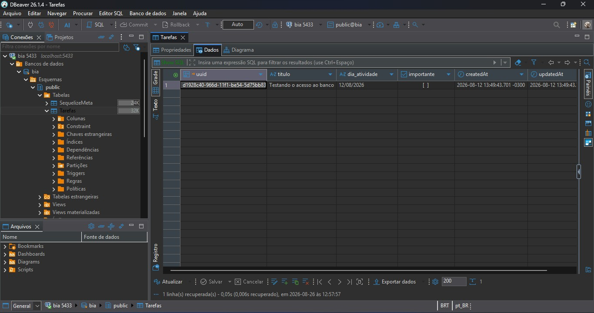

Repare em três coisas nessa tela, que juntas fecham a exigência do desafio:

- A conexão é **`bia 5433` em `localhost:5433`** — porta publicada pelo container, não a `5432` interna
- As tabelas **`Tarefas`** e **`SequelizeMeta`** existem, resultado das migrations da etapa 10
- A grade traz o registro real, com `titulo`, `dia_atividade` e `createdAt` — o mesmo dado que a
  aplicação gravou em `localhost:3001`

#### Conferindo pelo terminal

O DBeaver é uma interface gráfica para uma conexão TCP comum — e essa conexão dá para comprovar por
linha de comando, o que também ajuda a diagnosticar quando o DBeaver falha.

**1. A porta `5433` está alcançável a partir do Windows** (é o caminho exato que o DBeaver percorre).
No PowerShell:

```powershell
Test-NetConnection -ComputerName localhost -Port 5433
```

```text
ComputerName     : localhost
RemotePort       : 5433
TcpTestSucceeded : True
```

`TcpTestSucceeded : True` significa que o `localhostForwarding` da etapa 3 está funcionando e o
container está publicando a porta. Se der `False`, o problema é de rede/container — não do DBeaver.

**2. O banco responde e tem os dados**, consultado de fora do container da aplicação:

```bash
docker compose exec database psql -U postgres -d bia -c 'SELECT titulo, dia_atividade FROM "Tarefas";'
```

```text
           titulo           | dia_atividade
----------------------------+---------------
 Testando o acesso ao banco | 12/08/2026
(1 row)
```

É o mesmo registro que o DBeaver exibe na grade de resultados.

---

### 12. Provar a persistência dos dados

**O que vamos fazer:** o teste central do desafio — derrubar todo o ambiente e comprovar que os
dados continuam existindo. Isso funciona porque o PostgreSQL grava em um **volume nomeado**, que
tem vida independente do container.

```bash
docker volume ls | grep bia
```

```text
local     bia_db
```

Agora o teste, em quatro passos:

```bash
# 1. Confirme que existe uma tarefa cadastrada em http://localhost:3001

# 2. Derrube os containers (o volume permanece)
docker compose down

# 3. Suba tudo de novo
docker compose up -d

# 4. Abra http://localhost:3001 novamente
```

Repare no que o `down` remove — containers e rede, mas **nenhum volume**:

```text
 Container bia Removed
 Container redis Removed
 Container database Removed
 Network bia_default Removing
 Network bia_default Removed
```

**Como saber que deu certo:** a tarefa cadastrada antes do `down` continua na tela — e você **não**
precisou rodar as migrations de novo. Para conferir direto no banco, sem abrir o navegador:

```bash
docker compose exec database psql -U postgres -d bia -c 'SELECT titulo, dia_atividade FROM "Tarefas";'
```

```text
           titulo           | dia_atividade
----------------------------+---------------
 Testando o acesso ao banco | 12/08/2026
(1 row)
```

O registro é o mesmo de antes do `down` — mesmo `uuid`, mesma data de criação. O container foi
destruído e recriado; o dado não.

> 💡 As aspas duplas em `"Tarefas"` são obrigatórias: o Sequelize cria a tabela com T maiúsculo, e o
> PostgreSQL só preserva maiúsculas em identificadores entre aspas. Sem elas o comando falha com
> *relation "tarefas" does not exist*.

> ⚠️ **A diferença que importa:**
>
> | Comando | O que faz |
> | --- | --- |
> | `docker compose down` | Remove containers e rede. **Os volumes — e os dados — permanecem.** |
> | `docker compose down -v` | Remove também os volumes. **Apaga o banco inteiro.** |
>
> Depois de um `down -v` você precisa repetir a etapa 10 (migrations) do zero.

---

# Parte 2 — Levando para a AWS

> Com o ambiente local validado, a mesma stack vai para a nuvem. Da etapa 15 em diante, cada passo
> traz o **caminho pelo Console** (mais visual) e, em bloco recolhível, o **comando equivalente no
> CloudShell** — use o que preferir, o resultado é o mesmo.

> ℹ️ **Sobre as evidências desta parte.** O laboratório na AWS foi destruído ao final (etapa 22),
> como manda a boa prática de custo. Por isso, as capturas de tela que restam deste ambiente são as
> das etapas **18** (instância no console) e **21** (aplicação respondendo pelo IP público). Nas
> demais etapas, em vez de imagem, você encontra um bloco **"Como confirmar"** com o comando de
> verificação para rodar no seu próprio ambiente enquanto ele existir. É uma escolha deliberada:
> preferi entregar um comando que você pode executar a exibir um print que não comprova o seu setup.

---

### 13. Conta, Free Tier e Budget

**O que vamos fazer:** proteger o cartão **antes** de criar qualquer recurso. Esta é a primeira
etapa da nuvem por um motivo: recurso esquecido ligado é a forma mais comum de tomar um susto na
fatura.

1. Crie a conta em <https://aws.amazon.com/free/> (a camada **Free Tier** cobre este laboratório)
2. No Console, vá em **Billing and Cost Management → Budgets → Create budget**
3. Escolha **Monthly cost budget**, defina um valor baixo (ex.: `US$ 5,00`)
4. Cadastre o seu e-mail para receber o alerta

**Como saber que deu certo:** o budget aparece na lista com status *OK* e um alerta configurado.

<details>
<summary><strong>Como confirmar pelo CloudShell (depois da etapa 14)</strong></summary>

```bash
aws budgets describe-budgets \
  --account-id "$(aws sts get-caller-identity --query Account --output text)" \
  --query 'Budgets[*].[BudgetName,BudgetLimit.Amount,TimeUnit]' --output table
```

O budget criado aparece na tabela com o valor-limite que você definiu.

</details>

> 💡 Defina também a região de trabalho no canto superior direito do Console: **`us-east-1`
> (N. Virginia)**. Todos os recursos deste passo a passo vivem nela. Recurso criado na região errada
> simplesmente "some" da tela — e continua sendo cobrado.

---

### 14. CloudShell e definição da região

**O que vamos fazer:** abrir um terminal Linux dentro do próprio navegador, já autenticado na sua
conta. É por ele que rodaremos os comandos da AWS CLI, sem instalar nada no notebook.

Clique no ícone do **CloudShell** (`>_`) na barra superior do Console, ao lado do seletor de região.

| Característica | Valor |
| --- | --- |
| Armazenamento | 1 GB por região |
| Memória | 2 GB |
| Já vem instalado | `aws cli`, `git`, `python`, `node` |
| Custo | Gratuito |

**Como saber que deu certo:**

```bash
aws sts get-caller-identity
aws configure get region
```

O primeiro comando devolve a sua conta e identidade; o segundo deve devolver `us-east-1`.

> 💡 **Por que usar o CloudShell em vez da AWS CLI no notebook?** Ele já vem autenticado. Você não
> precisa gerar chaves de acesso (`AKIA...`) e guardá-las na sua máquina — que é exatamente o tipo
> de credencial que mais vaza em repositórios públicos.

---

### 15. Criar os Security Groups

**O que vamos fazer:** criar as regras de firewall **antes** da máquina existir. Um Security Group
é uma lista do que pode entrar; tudo que não está liberado, é bloqueado.

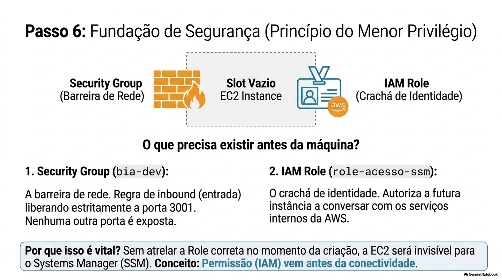

Vamos criar dois:

| Security Group | Libera | Para quem | Protege |
| --- | --- | --- | --- |
| `bia-dev` | TCP `3001` | `0.0.0.0/0` (internet) | A aplicação na EC2 |
| `bia-db` | TCP `5432` | Apenas o SG `bia-dev` | O banco no RDS |

**Pelo Console:**

1. **EC2 → Security Groups → Create security group**
2. Name: `bia-dev` | Description: `Acesso a aplicacao BIA na porta 3001` | VPC: a *default*
3. Em **Inbound rules → Add rule**: Type `Custom TCP`, Port `3001`, Source `Anywhere-IPv4`
4. **Create security group**
5. Repita para o `bia-db`: Type `PostgreSQL`, Port `5432`, e em **Source** escolha **Custom** e
   selecione o Security Group **`bia-dev`** na lista

<details>
<summary><strong>Mesmo passo pelo CloudShell (AWS CLI)</strong></summary>

```bash
# Descobrir a VPC padrão
VPC_ID=$(aws ec2 describe-vpcs --filters Name=isDefault,Values=true \
  --query 'Vpcs[0].VpcId' --output text)

# Security Group da aplicação
SG_APP=$(aws ec2 create-security-group \
  --group-name bia-dev \
  --description "Acesso a aplicacao BIA na porta 3001" \
  --vpc-id "$VPC_ID" --query 'GroupId' --output text)

aws ec2 authorize-security-group-ingress \
  --group-id "$SG_APP" --protocol tcp --port 3001 --cidr 0.0.0.0/0

# Security Group do banco — origem é o SG da aplicação, não a internet
SG_DB=$(aws ec2 create-security-group \
  --group-name bia-db \
  --description "Acesso ao RDS somente a partir da EC2" \
  --vpc-id "$VPC_ID" --query 'GroupId' --output text)

aws ec2 authorize-security-group-ingress \
  --group-id "$SG_DB" --protocol tcp --port 5432 --source-group "$SG_APP"

echo "SG_APP=$SG_APP"
echo "SG_DB=$SG_DB"
```

</details>

**Como confirmar pelo CloudShell:**

```bash
aws ec2 describe-security-groups --group-names bia-dev bia-db \
  --query 'SecurityGroups[*].[GroupName,IpPermissions[0].FromPort]' --output table
```

A tabela traz `bia-dev` com `3001` e `bia-db` com `5432`. Para checar que a origem do banco é o
outro grupo — e não a internet:

```bash
aws ec2 describe-security-groups --group-names bia-db \
  --query 'SecurityGroups[0].IpPermissions[0].UserIdGroupPairs[*].GroupId' --output text
```

Isso devolve o **ID do grupo `bia-dev`**. Se em vez disso aparecer `0.0.0.0/0` em `IpRanges`, a regra
foi criada aberta para a internet e precisa ser corrigida.

**Como saber que deu certo:** os dois grupos aparecem em **EC2 → Security Groups**, e a regra de
entrada do `bia-db` mostra o *ID do grupo* `bia-dev` como origem — e não um bloco de IPs.

> 💡 **Por que o banco não fica aberto para a internet?** Porque ele não precisa. Só a aplicação
> conversa com ele. Apontar a origem para outro Security Group significa "qualquer máquina que
> pertença ao grupo `bia-dev` pode entrar" — mesmo que o IP dela mude.

---

### 16. Criar a IAM Role de acesso ao SSM

**O que vamos fazer:** criar o "crachá" que a instância vai vestir. Sem ele, o Systems Manager
nem enxerga a máquina — e você fica sem forma de entrar nela.

**Pelo Console:**

1. **IAM → Roles → Create role**
2. Trusted entity type: **AWS service** | Use case: **EC2** → *Next*
3. Em **Permissions**, busque e marque a policy **`AmazonSSMManagedInstanceCore`** → *Next*
4. Role name: **`role-acesso-ssm`** → **Create role**

<details>
<summary><strong>Mesmo passo pelo CloudShell (AWS CLI)</strong></summary>

```bash
# Política de confiança: quem pode assumir esta role
cat > trust-policy.json <<'EOF'
{
  "Version": "2012-10-17",
  "Statement": [{
    "Effect": "Allow",
    "Principal": { "Service": "ec2.amazonaws.com" },
    "Action": "sts:AssumeRole"
  }]
}
EOF

aws iam create-role \
  --role-name role-acesso-ssm \
  --assume-role-policy-document file://trust-policy.json

aws iam attach-role-policy \
  --role-name role-acesso-ssm \
  --policy-arn arn:aws:iam::aws:policy/AmazonSSMManagedInstanceCore

# O instance profile é o "invólucro" que a EC2 realmente anexa
aws iam create-instance-profile --instance-profile-name role-acesso-ssm
aws iam add-role-to-instance-profile \
  --instance-profile-name role-acesso-ssm \
  --role-name role-acesso-ssm
```

</details>

**Como saber que deu certo:**

```bash
aws iam list-attached-role-policies --role-name role-acesso-ssm
```

A policy `AmazonSSMManagedInstanceCore` aparece na lista.

> 💡 **Permissão vem antes de conectividade.** Se a instância não aparecer no Session Manager
> depois de criada, o problema quase nunca é rede — é esta role não ter sido anexada.

---

### 17. Provisionar o RDS PostgreSQL

**O que vamos fazer:** criar o banco de dados gerenciado que substitui o container de PostgreSQL
que usamos localmente. A partir daqui, a aplicação passa a ser descartável — os dados moram fora.

**Pelo Console:**

1. **RDS → Databases → Create database**
2. Method: **Standard create** | Engine: **PostgreSQL**
3. Templates: **Free tier**
4. DB instance identifier: `bia-db`
5. Master username: `postgres` | Master password: defina uma senha e **guarde**
6. Instance configuration: `db.t3.micro`
7. Connectivity: **Public access = No**, e em *VPC security group* escolha **`bia-db`**
8. Em **Additional configuration**, preencha **Initial database name** com **`bia`**
9. **Create database** (leva alguns minutos)

> ⚠️ **O passo 8 é obrigatório.** A aplicação BIA tem o nome do banco fixo no código como `bia`
> (em `config/database.js`). Se você deixar o *initial database name* em branco, o RDS sobe sem
> nenhum banco criado e a aplicação não conecta.

<details>
<summary><strong>Mesmo passo pelo CloudShell (AWS CLI)</strong></summary>

```bash
SG_DB=$(aws ec2 describe-security-groups --group-names bia-db \
  --query 'SecurityGroups[0].GroupId' --output text)

aws rds create-db-instance \
  --db-instance-identifier bia-db \
  --db-instance-class db.t3.micro \
  --engine postgres \
  --master-username postgres \
  --master-user-password 'TROQUE_ESTA_SENHA' \
  --allocated-storage 20 \
  --db-name bia \
  --vpc-security-group-ids "$SG_DB" \
  --no-publicly-accessible \
  --backup-retention-period 0

# Acompanhar até ficar "available"
aws rds wait db-instance-available --db-instance-identifier bia-db
```

</details>

**Como confirmar pelo CloudShell** — status, nome do banco e endpoint de uma vez:

```bash
aws rds describe-db-instances --db-instance-identifier bia-db \
  --query 'DBInstances[0].[DBInstanceStatus,DBName,Endpoint.Address,PubliclyAccessible]' \
  --output table
```

Os quatro valores precisam ser, nesta ordem: `available`, **`bia`**, o endpoint, e `False`. Se
`DBName` vier vazio, o *initial database name* não foi preenchido e a aplicação não vai conectar —
volte ao passo 8.

**Como saber que deu certo:** o status vira **Available** e você consegue capturar o endpoint:

```bash
aws rds describe-db-instances --db-instance-identifier bia-db \
  --query 'DBInstances[0].Endpoint.Address' --output text
```

```text
bia-db.xxxxxxxxxxxx.us-east-1.rds.amazonaws.com
```

**Guarde esse endereço** — ele é o `DB_HOST` da etapa 20.

---

### 18. Lançar a instância EC2

**O que vamos fazer:** criar a máquina virtual que vai rodar o container da aplicação — sem
gerar nenhuma chave `.pem`.

**Pelo Console:**

1. **EC2 → Instances → Launch instances**
2. Name: **`bia-dev`**
3. AMI: **Amazon Linux 2023** (já vem com o SSM Agent instalado)
4. Instance type: **`t3.micro`**
5. Key pair: **Proceed without a key pair** ← é isso mesmo
6. Network settings → **Select existing security group** → **`bia-dev`**
7. **Advanced details → IAM instance profile** → **`role-acesso-ssm`**
8. **Launch instance**

<details>
<summary><strong>Mesmo passo pelo CloudShell (AWS CLI)</strong></summary>

```bash
SG_APP=$(aws ec2 describe-security-groups --group-names bia-dev \
  --query 'SecurityGroups[0].GroupId' --output text)

AMI_ID=$(aws ssm get-parameters \
  --names /aws/service/ami-amazon-linux-latest/al2023-ami-kernel-default-x86_64 \
  --query 'Parameters[0].Value' --output text)

aws ec2 run-instances \
  --image-id "$AMI_ID" \
  --instance-type t3.micro \
  --security-group-ids "$SG_APP" \
  --iam-instance-profile Name=role-acesso-ssm \
  --placement AvailabilityZone=us-east-1a \
  --tag-specifications 'ResourceType=instance,Tags=[{Key=Name,Value=bia-dev}]'
```

</details>

**Como confirmar pelo CloudShell:**

```bash
aws ec2 describe-instances --filters Name=tag:Name,Values=bia-dev \
  --query 'Reservations[*].Instances[*].[InstanceId,State.Name,InstanceType,Placement.AvailabilityZone]' \
  --output table
```

Esperado: uma linha com `running`, `t3.micro` e `us-east-1a`.

**Como saber que deu certo:** a instância aparece como **Running** com **3/3 checks passed**.

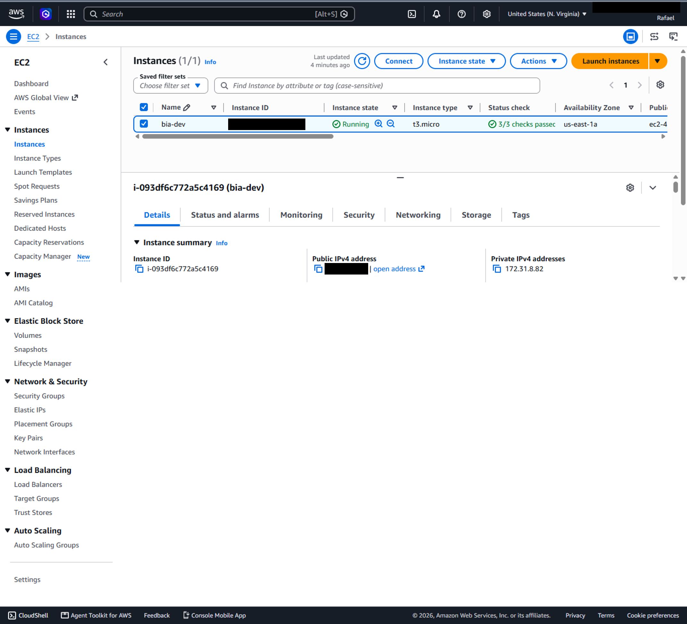

> 💡 Se preferir Ubuntu no lugar do Amazon Linux, saiba que o SSM Agent **não** vem ativo por
> padrão em todas as AMIs — seria preciso instalá-lo via `snap install amazon-ssm-agent`. O Amazon
> Linux 2023 já vem pronto, o que remove uma fonte de erro.

---

### 19. Conectar na EC2 via SSM Session Manager

**O que vamos fazer:** abrir um terminal na instância pelo navegador, sem SSH, sem porta 22 e sem
chave privada.

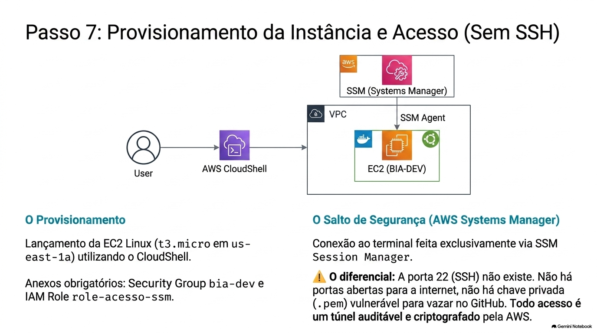

**Pelo Console:** selecione a instância `bia-dev` → **Connect** → aba **Session Manager** →
**Connect**.

<details>
<summary><strong>Mesmo passo pelo CloudShell (AWS CLI)</strong></summary>

```bash
INSTANCE_ID=$(aws ec2 describe-instances \
  --filters Name=tag:Name,Values=bia-dev Name=instance-state-name,Values=running \
  --query 'Reservations[0].Instances[0].InstanceId' --output text)

aws ssm start-session --target "$INSTANCE_ID"
```

</details>

**Como confirmar que a instância está registrada no SSM** — esta é a verificação mais útil da Parte 2,
porque prova que a IAM Role da etapa 16 funcionou:

```bash
aws ssm describe-instance-information \
  --query 'InstanceInformationList[*].[InstanceId,PingStatus,PlatformName]' --output table
```

A instância precisa aparecer com `PingStatus = Online`. **Lista vazia é o sintoma clássico de role
ausente ou errada** — não de problema de rede.

**Como saber que deu certo:** você recebe um prompt de shell na instância:

```bash
whoami        # ssm-user
sudo -i       # virar root para os próximos comandos
```

> ⚠️ **A instância não aparece na lista do Session Manager?** Espere 2 a 3 minutos após o boot —
> o SSM Agent leva um tempo para registrar. Se continuar ausente, o problema é a IAM Role da
> etapa 16 não estar anexada. Confira em **EC2 → Instance → Security → IAM Role**.

---

### 20. Fazer o deploy da BIA na EC2

**O que vamos fazer:** instalar o Docker na instância, construir a imagem da aplicação e subir o
container apontando para o RDS. Note que aqui subimos **apenas a aplicação** — o banco agora é o
RDS, e o container de PostgreSQL não é mais necessário.

Dentro da sessão SSM, como root:

```bash
# 1. Instalar Docker e Git
dnf update -y
dnf install -y docker git
systemctl enable --now docker

# 2. Clonar a aplicação
cd /opt
git clone https://github.com/henrylle/bia
cd bia
```

**Ajuste obrigatório antes de construir a imagem:**

```bash
# 3. O front-end é compilado com a URL da API fixa no Dockerfile.
#    Sem esta troca, o navegador tentaria chamar "localhost:3001" da máquina de quem acessa.
IP_PUBLICO=$(curl -s http://169.254.169.254/latest/meta-data/public-ipv4)
echo "IP público da instância: $IP_PUBLICO"

sed -i "s|VITE_API_URL=http://localhost:3001|VITE_API_URL=http://$IP_PUBLICO:3001|" Dockerfile
grep VITE_API_URL Dockerfile    # conferir que o IP entrou
```

> ⚠️ **Este é o erro mais comum de quem chega até aqui.** A página abre normalmente, mas o
> formulário não salva nada. O motivo é que o `Dockerfile` da BIA compila o React com
> `VITE_API_URL=http://localhost:3001` — e `localhost`, no navegador do visitante, é o computador
> *dele*, não a EC2.

Agora construa e suba, apontando para o RDS:

```bash
# 4. Construir a imagem
docker build -t bia:latest .

# 5. Subir o container com as variáveis do RDS
docker run -d --name bia --restart unless-stopped -p 3001:8080 \
  -e DB_HOST='<ENDPOINT-DO-RDS>' \
  -e DB_PORT=5432 \
  -e DB_USER=postgres \
  -e DB_PWD='<SENHA-DO-RDS>' \
  bia:latest

# 6. Criar as tabelas no RDS (mesma etapa 10, agora na nuvem)
docker exec bia bash -c 'npx sequelize db:migrate'
```

> ⚠️ **`DB_PORT=5432` é obrigatório.** Se a variável não for informada, a aplicação assume `5433`
> (o valor usado no ambiente local) e a conexão com o RDS falha por timeout.

> 💡 **Sobre SSL:** você não precisa configurar nada. A aplicação detecta que o `DB_HOST` não é
> `localhost` nem `database` e liga o SSL automaticamente — que é o que o RDS exige por padrão.

**Como saber que deu certo:**

```bash
docker ps
docker logs bia --tail 30
```

Os logs devem mostrar o servidor escutando na porta 8080, sem erros de conexão com o banco.

**Como confirmar sem sair da instância** — a API responde localmente antes mesmo de você testar pelo
navegador:

```bash
curl -s http://localhost:3001/api/versao
```

```text
Bia 4.3.0
```

Se este `curl` responde **dentro** da instância mas o navegador não abre pelo IP público, o problema
é o Security Group da etapa 15 — e não a aplicação.

---

### 21. Validar o resultado na nuvem

**O que vamos fazer:** o teste final — usar a aplicação pelo IP público e confirmar que o dado foi
parar no RDS.

1. Pegue o **IPv4 público** da instância em **EC2 → Instances → bia-dev**
2. Acesse `http://<IP-PÚBLICO-DA-EC2>:3001` no navegador
3. Cadastre uma tarefa

**Como saber que deu certo:** a tarefa aparece na lista. Recarregue a página (`F5`) — ela continua
lá, porque foi gravada no RDS e não na memória do container.


Para uma prova adicional, reinicie o container e confirme que o dado sobrevive:

```bash
docker restart bia
```

O dado continua — exatamente o mesmo princípio da etapa 12, agora com o banco fora da máquina.

**Como confirmar de fora da AWS**, do seu próprio terminal:

```bash
curl -s http://<IP-PÚBLICO-DA-EC2>:3001/api/versao
```

```text
Bia 4.3.0
```

Essa resposta chegando na sua máquina fecha o circuito completo: internet → Security Group `bia-dev`
→ EC2 → container → porta 8080 → RDS.

---

### 22. Destruir o laboratório

**O que vamos fazer:** apagar tudo. Laboratório concluído é laboratório destruído — o custo na
nuvem só para quando a infraestrutura deixa de existir.

| # | Recurso | Onde | Atenção |
| :-: | --- | --- | --- |
| 1 | Instância EC2 `bia-dev` | EC2 → Instances → Instance state → **Terminate** | — |
| 2 | Banco RDS `bia-db` | RDS → Databases → Actions → **Delete** | **Desmarque "Create final snapshot"** — snapshots também são cobrados |
| 3 | Security Groups `bia-dev` e `bia-db` | EC2 → Security Groups | Só depois que a EC2 e o RDS sumirem |
| 4 | IAM Role `role-acesso-ssm` | IAM → Roles | Se não for reaproveitar em outro laboratório |

<details>
<summary><strong>Mesmo passo pelo CloudShell (AWS CLI)</strong></summary>

```bash
# 1. EC2
INSTANCE_ID=$(aws ec2 describe-instances \
  --filters Name=tag:Name,Values=bia-dev Name=instance-state-name,Values=running \
  --query 'Reservations[0].Instances[0].InstanceId' --output text)
aws ec2 terminate-instances --instance-ids "$INSTANCE_ID"
aws ec2 wait instance-terminated --instance-ids "$INSTANCE_ID"

# 2. RDS — sem snapshot final
aws rds delete-db-instance --db-instance-identifier bia-db \
  --skip-final-snapshot --delete-automated-backups
aws rds wait db-instance-deleted --db-instance-identifier bia-db

# 3. Security Groups
aws ec2 delete-security-group --group-name bia-db
aws ec2 delete-security-group --group-name bia-dev

# 4. IAM
aws iam remove-role-from-instance-profile \
  --instance-profile-name role-acesso-ssm --role-name role-acesso-ssm
aws iam delete-instance-profile --instance-profile-name role-acesso-ssm
aws iam detach-role-policy --role-name role-acesso-ssm \
  --policy-arn arn:aws:iam::aws:policy/AmazonSSMManagedInstanceCore
aws iam delete-role --role-name role-acesso-ssm
```

</details>

**Como saber que deu certo:** no dia seguinte, confira o **Budget** e o **Cost Explorer**. O custo
do laboratório deve estar zerado.

---

## 🩺 Solução de problemas

| Sintoma | Causa provável | Correção |
| --- | --- | --- |
| `docker version` mostra só o *Client* | Integração WSL não habilitada | Etapa 7 — marcar `Ubuntu-24.04` no Docker Desktop e reiniciar a distro |
| `docker: command not found` no Ubuntu | Distro iniciada antes do *Apply & Restart* | `wsl --terminate Ubuntu-24.04` e abrir de novo |
| `localhost:3001` não abre no Windows | `localhostForwarding` ausente no `.wslconfig` | Etapa 3 — conferir o arquivo e rodar `wsl --shutdown` |
| A página abre, mas cadastrar tarefa dá erro | Migrations não rodadas | Etapa 10 — `docker compose exec server bash -c 'npx sequelize db:migrate'` |
| DBeaver: *connection refused* na 5433 | Container `database` fora do ar | `docker compose ps` — a porta `5433->5432` precisa aparecer |
| `relation "tarefas" does not exist` | Nome da tabela sem aspas no SQL | A tabela é `Tarefas`; use `SELECT ... FROM "Tarefas"` |
| Os dados sumiram depois de reiniciar | Foi usado `docker compose down -v` | O `-v` apaga os volumes; repita a etapa 10 |
| `docker compose up -d` demora demais | Primeira build compilando o front-end | Normal em máquinas modestas — acompanhe com `docker compose logs -f server` |
| A EC2 não aparece no Session Manager | IAM Role não anexada, ou boot recente | Etapa 16 — conferir a role; aguardar 2–3 min após o *Running* |
| Na AWS a página abre mas não salva | `VITE_API_URL` apontando para `localhost` | Etapa 20, passo 3 — refazer o `sed` e reconstruir a imagem |
| Na AWS, timeout ao conectar no banco | `DB_PORT` não informado (assume 5433) | Etapa 20 — incluir `-e DB_PORT=5432` no `docker run` |
| RDS *available*, mas a app não conecta | Banco `bia` não criado, ou SG errado | Etapa 17 — *initial database name* = `bia` e SG `bia-db` liberando o `bia-dev` |

---

## 🔍 Provas de execução

Cada exigência do desafio e onde está a evidência dela neste documento.

| Exigência do desafio | Evidência | Tipo | Onde |
| --- | --- | :-: | :-: |
| Ambiente Linux com Docker funcionando | `docker version` exibindo **Client e Server** | comando | [Etapa 7](#7-integrar-o-docker-desktop-ao-wsl-2) |
| Projeto BIA rodando localmente | Captura da aplicação + `docker compose ps` + `curl /api/versao` → `Bia 4.3.0` | captura + saída | [Etapa 9](#9-subir-o-projeto-bia) |
| Schema do banco criado | Saída do `sequelize db:migrate` + `\dt` listando `Tarefas` e `SequelizeMeta` | saída real | [Etapa 10](#10-rodar-as-migrations-do-banco) |
| **Banco acessível externamente (DBeaver)** | Captura do DBeaver conectado em `localhost:5433` com a tabela `Tarefas` e o registro + `TcpTestSucceeded : True` a partir do Windows | captura + saída real | [Etapa 11](#11-conectar-o-dbeaver-ao-banco) |
| **Persistência dos dados** | Volume `bia_db` intacto após o `down`; registro presente após o `up`, sem repetir migrations | saída real | [Etapa 12](#12-provar-a-persistência-dos-dados) |
| Controle de custo antes dos recursos | `aws budgets describe-budgets` | verificação | [Etapa 13](#13-conta-free-tier-e-budget) |
| Rede restrita por Security Group | `describe-security-groups` mostrando `3001` aberto e `5432` só para o SG da aplicação | verificação | [Etapa 15](#15-criar-os-security-groups) |
| Banco gerenciado no RDS | `describe-db-instances` → `available`, `DBName = bia`, `PubliclyAccessible = False` | verificação | [Etapa 17](#17-provisionar-o-rds-postgresql) |
| Instância EC2 provisionada | Captura do console (Running, 3/3 checks) + `describe-instances` | captura + verificação | [Etapa 18](#18-lançar-a-instância-ec2) |
| Acesso sem SSH | `describe-instance-information` → `PingStatus = Online` | verificação | [Etapa 19](#19-conectar-na-ec2-via-ssm-session-manager) |
| Aplicação publicada na nuvem | Captura da aplicação pelo IP público + `curl /api/versao` externo | captura + verificação | [Etapa 21](#21-validar-o-resultado-na-nuvem) |
| Ambiente destruído ao final | Checklist de destruição e conferência no Cost Explorer | procedimento | [Etapa 22](#22-destruir-o-laboratório) |

**Como ler a coluna "Tipo":**

| Tipo | Significa |
| --- | --- |
| **saída real** | Texto efetivamente capturado nesta máquina, com o ambiente no ar |
| **captura** | Screenshot tirado durante a execução do laboratório |
| **verificação** | Comando para **você** rodar e validar o seu próprio ambiente. Os recursos da AWS deste laboratório foram destruídos na etapa 22, então aqui não há registro a exibir — há o comando que produz a prova no seu setup |

---

## ✅ Checklist de entrega

| # | Item | Etapa | Status |
| :-: | --- | :-: | :-: |
| 1 | WSL 2 instalado e validado | 1–2 | ✅ |
| 2 | Ubuntu 24.04 LTS como distro de trabalho | 2 | ✅ |
| 3 | `.wslconfig` limitando RAM, CPU e swap | 3 | ✅ |
| 4 | Git instalado e configurado no Ubuntu | 4 | ✅ |
| 5 | Autenticação SSH no GitHub funcionando | 5 | ✅ |
| 6 | VS Code conectado ao WSL | 6 | ✅ |
| 7 | Docker Desktop integrado ao WSL 2 | 7 | ✅ |
| 8 | Docker Compose validado | 8 | ✅ |
| 9 | Projeto BIA rodando em `localhost:3001` | 9 | ✅ |
| 10 | Migrations aplicadas e tabela `Tarefas` criada | 10 | ✅ |
| 11 | DBeaver conectado ao PostgreSQL em `5433` | 11 | ✅ |
| 12 | Persistência de dados comprovada | 12 | ✅ |
| 13 | AWS Budget configurado antes de tudo | 13 | ✅ |
| 14 | CloudShell operacional em `us-east-1` | 14 | ✅ |
| 15 | Security Groups `bia-dev` e `bia-db` | 15 | ✅ |
| 16 | IAM Role `role-acesso-ssm` | 16 | ✅ |
| 17 | RDS PostgreSQL provisionado | 17 | ✅ |
| 18 | EC2 `bia-dev` lançada sem key pair | 18 | ✅ |
| 19 | Acesso à instância via SSM Session Manager | 19 | ✅ |
| 20 | Aplicação publicada na EC2 conectada ao RDS | 20 | ✅ |
| 21 | Validação pelo IP público | 21 | ✅ |
| 22 | Laboratório destruído e custo conferido | 22 | ✅ |

---

## 🧠 O que aprendi

- **Mapeamento de portas não é detalhe.** Entender que `3001:8080` significa "host:container" e que
  a aplicação conversa com o banco pela porta *interna* (`5432`), não pela publicada (`5433`), é o
  que separa "copiei o comando" de "entendi a rede".
- **Persistência mora no volume, não no container.** `docker compose down` e
  `docker compose down -v` parecem o mesmo comando até a primeira vez que os dados somem.
- **O ambiente sobe, mas o schema não.** Container de banco no ar não significa aplicação
  funcionando: as migrations são uma etapa própria, e esquecê-las produz um erro que parece de
  código quando na verdade é de dados.
- **Dimensionar recursos é uma decisão de arquitetura.** Escolher WSL 2 no lugar de uma VM completa
  e limitar o ambiente a 3 GB foi o que tornou o laboratório possível em um notebook de 8 GB.
- **Acesso sem SSH é mais seguro e mais simples.** Com SSM Agent + IAM Role não há porta 22 aberta
  nem chave privada circulando, e todo acesso fica auditável.
- **Permissão vem antes de conectividade.** Uma EC2 sem a role correta não aparece no Session
  Manager — não é problema de rede, é de IAM.
- **O que é build-time não se corrige em runtime.** A URL da API do front-end é compilada dentro da
  imagem: mudar variável de ambiente no `docker run` não resolve, é preciso reconstruir.
- **Custo é responsabilidade técnica.** Budget configurado antes do primeiro recurso e destruição do
  ambiente ao final fazem parte do trabalho, não são um extra.

---

## 🧩 Apêndice — Fundamentos de Git e Docker

> ### Por que este apêndice existe
>
> As 22 etapas acima mostram **o que foi feito**. Este apêndice explica **por que funciona** — o que
> cada comando de Git e de Docker realmente faz por baixo.
>
> Ele é autônomo: dá para ler antes do laboratório, para entender o terreno, ou depois, como material
> de consulta. A estrutura é a mesma do resto do documento — **o que vamos fazer**, **os comandos** e
> **como saber que deu certo**.
>
> **Regra deste apêndice:** nenhum comando aparece sem explicação de uso. Toda opção (`-t`, `-i`,
> `-d`, `-p`, `-a`, `-f`, `-v`) é explicada na primeira vez em que aparece.


Esse infográfico é o mapa completo do caminho. Ele se lê em quatro movimentos, e é exatamente essa a
ordem das subseções abaixo:

| # | Movimento | Ferramenta | O que entra | O que sai |
| :-: | --- | --- | --- | --- |
| **01** | Gestão de versão local | Git | Arquivos editados | Um *snapshot* gravado no histórico (`.git`) |
| **02** | Sincronização em nuvem | GitHub | Commits locais | Repositório remoto pronto para colaboração |
| **03** | Construção do molde | Docker Engine | Um `Dockerfile` | Uma **imagem** imutável com tudo dentro |
| **04** | Instanciação e execução | Docker Container | Uma imagem | A aplicação **rodando**, isolada e leve |

> 💡 Git e Docker resolvem **problemas diferentes**, mas encaixados. O Git versiona o **código**;
> o Docker versiona o **ambiente**. Juntos, respondem "que versão é essa?" e "onde ela roda?".

---

### A. O problema que Git e Docker resolvem

**O que vamos entender:** por que estas duas ferramentas existem. Sem isso, os comandos das próximas
seções viram decoreba.

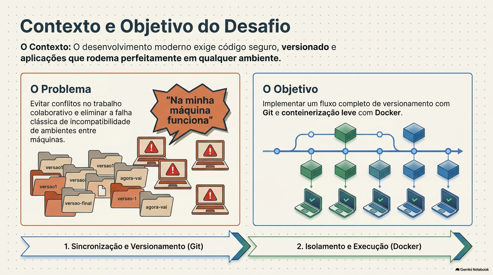

| Problema real | Como ele aparece no dia a dia | Quem resolve |
| --- | --- | --- |
| Não sei qual versão é a boa | Pastas `projeto`, `projeto-final`, `projeto-final-2`, `agora-vai` | **Git** — um histórico só, linear e rastreável |
| Sobrescrevi o trabalho de alguém | Dois arquivos colidem e um deles some | **Git** — branches e *merge* controlado |
| Não sei quem mudou o quê, nem quando | Ninguém consegue explicar como o bug entrou | **Git** — cada commit tem autor, data e mensagem |
| "Na minha máquina funciona" | Roda no notebook do dev e quebra no servidor | **Docker** — o ambiente inteiro vira um pacote |
| Configurar o ambiente leva um dia | Cada máquina nova exige um roteiro de instalação | **Docker** — `docker compose up -d` e pronto |

A frase da imagem — *"na minha máquina funciona"* — é o sintoma clássico. Ela acontece porque o
código é apenas metade do que faz um programa rodar; a outra metade é a **versão do Node, a versão
do PostgreSQL, as variáveis de ambiente, as bibliotecas do sistema**. O Git leva a primeira metade
para o servidor. O Docker leva a segunda.

> 💡 É por isso que o Desafio 1 prova que a **aplicação não muda** entre o notebook e a EC2. A mesma
> imagem sobe nos dois lugares — o que muda é só a infraestrutura debaixo dela.

---

### B. As três áreas do Git

**O que vamos fazer:** entender por onde um arquivo passa até virar história gravada. Este é o
conceito que faz o `git add` deixar de parecer burocracia.

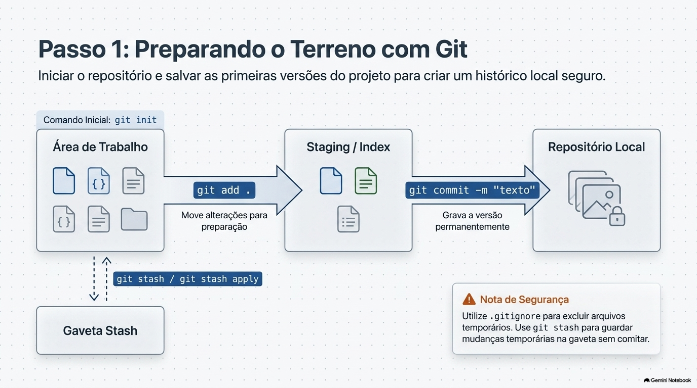

| Área | Onde fica | O que vive nela | Como se sai dela |
| --- | --- | --- | --- |
| **Área de trabalho** (*working directory*) | Os arquivos que você enxerga na pasta | Tudo que você está editando agora | `git add` |
| **Staging / Index** (*preparação*) | Um "carrinho de compras" invisível | Só o que você escolheu para o próximo commit | `git commit` |
| **Repositório local** | A pasta oculta `.git` | O histórico permanente, commit a commit | `git push` |

A grande sacada: **você escolhe o que entra em cada commit**. Se mexeu em cinco arquivos mas só três
pertencem à mesma ideia, adicione apenas esses três. O histórico fica legível.

#### Criando o repositório e o primeiro commit

```bash
git init                         # cria a pasta oculta .git — a partir daqui a pasta é versionada
git status                       # mostra o que mudou e em que área cada arquivo está
git add README.md                # move UM arquivo para a área de staging
git add .                        # move TODOS os arquivos modificados (o "." é "daqui pra baixo")
git commit -m "Primeira versao"  # grava no histórico o que estava em staging; -m é a mensagem
git log --oneline                # lista o histórico, um commit por linha
```

| Comando | O que faz | Quando usar |
| --- | --- | --- |
| `git init` | Transforma a pasta em repositório, criando o `.git` | Uma única vez, no início de um projeto novo |
| `git status` | Diz o estado de cada arquivo | **Sempre.** Antes do `add`, antes do `commit`, quando estiver perdido |
| `git add <arquivo>` | Manda um arquivo específico para o staging | Quando quer um commit enxuto, com um assunto só |
| `git add .` | Manda tudo que mudou para o staging | Quando todas as mudanças pertencem à mesma ideia |
| `git commit -m "texto"` | Grava permanentemente o que está em staging | Ao terminar uma unidade de trabalho que faça sentido sozinha |
| `git log --oneline` | Mostra o histórico resumido | Para conferir o que já foi gravado |

**Como saber que deu certo:** o `git status` sai do vermelho, passa pelo verde e termina limpo.

```text
$ git status
On branch main
Changes not staged for commit:
        modified:   README.md          <- vermelho: mudou, mas está fora do staging

$ git add README.md
$ git status
On branch main
Changes to be committed:
        modified:   README.md          <- verde: pronto para o commit

$ git commit -m "Adiciona apendice de Git e Docker"
[main a1b2c3d] Adiciona apendice de Git e Docker
 1 file changed, 480 insertions(+)

$ git status
On branch main
nothing to commit, working tree clean    <- nada pendente: tudo virou história
```

> 💡 **Uma boa mensagem de commit completa a frase "Se aplicado, este commit vai…"**. `"Corrige o
> mapeamento da porta 3001"` é útil. `"ajustes"` não diz nada para o você de daqui a seis meses.

---

### C. Ignorar arquivos e guardar trabalho pela metade

**O que vamos fazer:** duas ferramentas de higiene que evitam os dois acidentes mais comuns —
commitar o que não devia e perder o que ainda não estava pronto.

#### `.gitignore` — o que nunca deve ser versionado

O `.gitignore` é um arquivo de texto na raiz do projeto. Cada linha é uma regra do que o Git deve
**fingir que não existe**. Ele não apaga nada do disco; apenas mantém o arquivo fora do repositório.

```gitignore
# ---- Credenciais e chaves (o motivo número 1 para existir um .gitignore) ----
*.pem                # chaves privadas de acesso a servidores
*.ppk                # o mesmo formato, na versão PuTTY
.env                 # variáveis de ambiente — costumam guardar senha de banco
credentials*         # arquivos de credencial da AWS e afins

# ---- Ruído que só existe na sua máquina ----
node_modules/        # a barra final significa "esta pasta inteira"
Thumbs.db            # cache de miniaturas do Windows
.DS_Store            # o equivalente do macOS

# ---- Material bruto que não faz parte da entrega ----
*.pdf                # o asterisco é curinga: qualquer arquivo terminado em .pdf
```

| Sintaxe | Significa |
| --- | --- |
| `arquivo.txt` | Ignora exatamente esse arquivo |
| `*.pem` | Ignora **qualquer** arquivo com essa extensão (`*` é curinga) |
| `pasta/` | Ignora a pasta inteira, com tudo dentro |
| `# comentário` | Linha de comentário — o Git ignora |

> ⚠️ **O `.gitignore` só protege o que ainda não foi commitado.** Se uma chave já entrou no
> histórico, apagá-la em um commit novo **não** a remove — ela continua recuperável nos commits
> antigos. Nesse caso, a chave precisa ser considerada vazada e **revogada**. É por isso que a
> [etapa 5](#5-autenticar-no-github-via-ssh) insiste que apenas o arquivo `.pub` vai para o GitHub.

#### `git stash` — a gaveta

Situação clássica: você está no meio de uma alteração, ela ainda não funciona, e precisa trocar de
tarefa **agora**. Commitar código quebrado é ruim; perder o trabalho é pior. O `stash` é a terceira
saída — uma gaveta temporária.

```bash
git stash        # guarda TODAS as mudanças não commitadas na gaveta e limpa a área de trabalho
git status       # confirma: a pasta voltou ao último commit, como se você não tivesse mexido
git stash list   # lista o que está guardado (stash@{0} é o mais recente)
git stash apply  # devolve as mudanças para a área de trabalho, mantendo uma cópia na gaveta
git stash pop    # devolve as mudanças E remove da gaveta
```

**Como saber que deu certo:** depois do `git stash` a árvore fica limpa; depois do `apply` as
alterações reaparecem.

```text
$ git stash
Saved working directory and index state WIP on main: a1b2c3d Ajusta o compose

$ git status
nothing to commit, working tree clean

$ git stash apply
On branch main
Changes not staged for commit:
        modified:   src/app.js         <- de volta, exatamente como estava
```

---

### D. Sincronizando com o GitHub

**O que vamos fazer:** conectar o repositório local a um servidor remoto. Até aqui tudo morava só na
sua máquina — um HD queimado levaria o histórico junto.

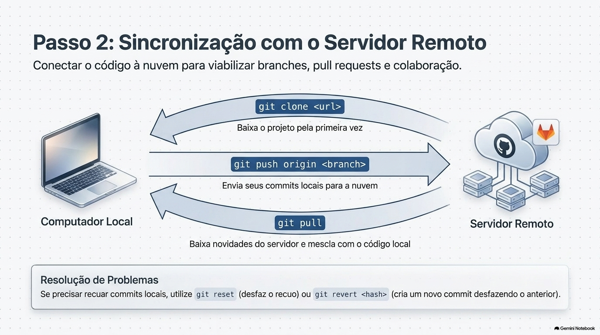

```bash
# Caminho 1 — o projeto JÁ existe no GitHub e você quer uma cópia
git clone https://github.com/usuario/projeto.git  # baixa o repositório inteiro, com todo o histórico
cd projeto                                        # o clone cria a pasta com o nome do projeto

# Caminho 2 — o projeto nasceu na sua máquina e vai subir agora
git remote add origin https://github.com/usuario/projeto.git  # apelida essa URL de "origin"
git remote -v                                                 # confere para onde "origin" aponta
git push -u origin main                                       # envia a branch main e memoriza o destino

# Rotina do dia a dia
git pull   # traz o que mudou no servidor e junta com o seu código local
git push   # envia seus commits (o -u da primeira vez dispensa repetir "origin main")
```

| Comando | O que faz | Detalhe que confunde |
| --- | --- | --- |
| `git clone <url>` | Baixa o projeto pela primeira vez | Já cria a pasta e já configura o `origin`. Não precisa de `git init` antes |
| `git remote add origin <url>` | Registra o endereço do servidor | `origin` é só um **apelido** — a convenção universal para "o servidor principal" |
| `git push -u origin main` | Envia os commits e fixa o destino | O `-u` (*upstream*) faz os `git push` seguintes funcionarem sem argumentos |
| `git pull` | Baixa e **já mescla** as novidades | É `git fetch` + `git merge` em um comando só |

**Como saber que deu certo:**

```text
$ git push -u origin main
Enumerating objects: 12, done.
Writing objects: 100% (12/12), 4.21 KiB | 1.05 MiB/s, done.
To https://github.com/usuario/projeto.git
 * [new branch]      main -> main
branch 'main' set up to track 'origin/main'.
```

E, no navegador, os arquivos aparecem na página do repositório.

> 💡 **Faça `git pull` antes de começar a trabalhar.** É o hábito que evita a maior parte dos
> conflitos: você parte do código mais recente, em vez de descobrir a divergência só na hora do push.

> 💡 A [etapa 5](#5-autenticar-no-github-via-ssh) configura a autenticação por **SSH**, que dispensa
> digitar usuário e senha a cada push. A [etapa 9](#9-subir-o-projeto-bia) usa o `git clone` na
> prática, para baixar o projeto BIA.

---

### E. Branches, merge e Pull Request

**O que vamos fazer:** trabalhar em uma ideia nova **sem** arriscar o código que já funciona.

Uma **branch** é uma linha do tempo paralela. Você sai da `main`, faz o que precisa em um mundo à
parte, e só junta de volta quando estiver pronto.

```text
   (main)   ●───────●──────────────────────●───────►  (main, agora com a novidade)
                     \                    /
   git checkout -b    \                  /   git merge mensagem
   mensagem            ●───────●────────●
                          (branch: mensagem)
```

```bash
git branch -a             # lista todas as branches; o -a inclui as que existem no servidor
git checkout -b mensagem  # CRIA a branch "mensagem" e já muda para ela (o -b é o "create")
# ... edite, git add, git commit à vontade — a main não é tocada ...
git checkout main         # volta para a main (sem -b, porque a branch já existe)
git merge mensagem        # traz para a main tudo que foi commitado na branch "mensagem"
git branch -d mensagem    # apaga a branch já mesclada; o -d só apaga se o merge foi feito
```

| Comando | O que faz | Quando usar |
| --- | --- | --- |
| `git branch -a` | Lista as branches locais e remotas | Para saber onde você está e o que existe |
| `git checkout -b <nome>` | Cria e entra na branch | Ao começar qualquer coisa que possa dar errado |
| `git checkout <nome>` | Só troca de branch | Para ir e voltar entre linhas de trabalho |
| `git merge <nome>` | Junta a branch indicada **na branch atual** | Quando a novidade está testada e pronta |
| `git branch -d <nome>` | Remove a branch já mesclada | Faxina: branch mesclada não precisa continuar existindo |

#### O Pull Request

O `git merge` junta as coisas direto, na sua máquina. O **Pull Request (PR)** é a versão social
disso: em vez de mesclar sozinho, você abre um pedido no GitHub — *"por favor, tragam a minha branch
para a main"* — e alguém revisa antes.

O fluxo completo:

```bash
git checkout -b minha-melhoria     # 1. cria a branch
git add .                          # 2. prepara as mudanças
git commit -m "Descreve a mudanca" # 3. grava no histórico local
git push -u origin minha-melhoria  # 4. envia a BRANCH para o GitHub (não a main)
```

5. No GitHub aparece o botão **Compare & pull request**. Clique, descreva o que mudou e abra o PR.
6. Alguém revisa, comenta e aprova.
7. **Merge pull request** — o GitHub faz o merge no servidor.
8. De volta ao terminal: `git checkout main` e `git pull`, para trazer o resultado.

#### Desfazer com segurança

Três comandos que parecem iguais e não são:

| Comando | O que desfaz | Reescreve o histórico? | Quando usar |
| --- | --- | :-: | --- |
| `git checkout .` | Alterações **não commitadas** na área de trabalho | Não | Errou a mão em um arquivo e quer voltar ao último commit |
| `git reset --soft HEAD~1` | O último commit, **mantendo** as mudanças em staging | Sim | Commitou cedo demais e quer refazer a mensagem ou juntar mais coisa |
| `git revert <hash>` | Um commit antigo, criando um **commit novo** que o anula | Não | O commit ruim já foi para o servidor |

```bash
git log --pretty=format:%h -n 1  # mostra o hash curto do último commit; -n 1 = só o mais recente
git revert a1b2c3d               # cria um commit que desfaz exatamente o commit a1b2c3d
git checkout .                   # descarta o que não foi commitado — NÃO tem desfazer
```

> ⚠️ **`reset` reescreve o histórico; `revert` não.** Se o commit já foi enviado com `git push`,
> usar `reset` faz a sua linha do tempo divergir da de todo mundo. Em branch compartilhada, a
> resposta certa é quase sempre `revert`.

> ⚠️ **`git checkout .` é definitivo.** O que não estava commitado nem guardado no stash não tem
> como voltar. Na dúvida, `git stash` antes.

---

### F. Referência rápida do Git

Os comandos deste apêndice em uma tabela só, para consulta.

| Comando | Ação principal | Quando usar |
| --- | --- | --- |
| `git init` | Inicia um repositório local | Projeto novo, uma vez só |
| `git clone <url>` | Copia um repositório existente | Para começar a trabalhar em algo que já existe |
| `git status` | Mostra o estado dos arquivos | Sempre — é a bússola |
| `git add <arquivo>` | Move um arquivo para o staging | Antes de todo commit |
| `git add .` | Move tudo que mudou para o staging | Quando as mudanças pertencem à mesma ideia |
| `git commit -m "texto"` | Grava no histórico | Ao fechar uma unidade de trabalho |
| `git log --oneline` | Lista o histórico resumido | Para conferir o que já existe |
| `git branch -a` | Lista as branches | Para se localizar |
| `git checkout -b <nome>` | Cria e entra na branch | Ao começar algo arriscado |
| `git checkout <branch>` | Alterna de branch | Para ir e voltar |
| `git checkout .` | Descarta alterações locais | Errou e quer voltar ao último commit |
| `git merge <branch>` | Junta a branch indicada na atual | Quando a novidade está pronta |
| `git push origin <branch>` | Envia commits para o servidor | Ao final do trabalho |
| `git pull` | Baixa e integra o que veio do servidor | Antes de começar a trabalhar |
| `git stash` | Guarda mudanças na gaveta | Precisa trocar de tarefa no meio |
| `git stash apply` | Devolve o que estava na gaveta | Ao retomar a tarefa interrompida |
| `git reset` | Recua commits locais | Só **antes** do push |
| `git revert <hash>` | Cria um commit que desfaz outro | **Depois** do push |
| `.gitignore` | Regras do que não versionar | Desde o primeiro commit |

---

### G. Container não é máquina virtual

**O que vamos entender:** a diferença que explica por que o Docker é leve — e por que este
laboratório coube em um notebook de 8 GB.

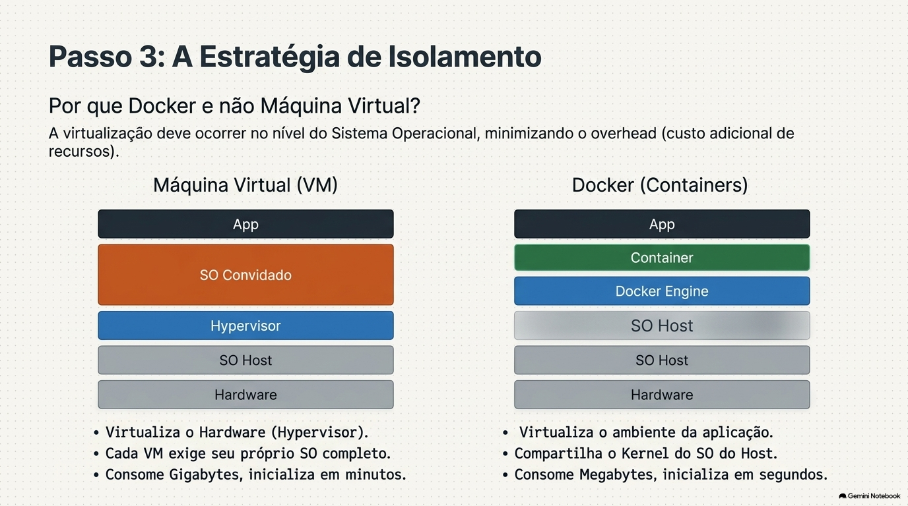

A diferença está em **o que é virtualizado**:

- A **máquina virtual** virtualiza o **hardware**. Um programa chamado *hypervisor* (VirtualBox,
  VMware) finge ser um computador inteiro, e dentro dele roda um **sistema operacional completo**,
  com kernel próprio. Cada VM carrega o peso de um SO inteiro.
- O **container** virtualiza o **sistema operacional**. Ele **compartilha o kernel do host** e usa
  recursos de isolamento do próprio Linux para separar os processos. Não existe um segundo SO.

> O **kernel** é o núcleo do sistema operacional: a peça que faz a ponte entre os programas e o
> hardware. Compartilhá-lo é o que torna o container leve — não é preciso carregar outro.

```text
MÁQUINA VIRTUAL                          DOCKER
App                                      App
 └── SO Convidado (kernel próprio)        └── Container
      └── Hypervisor                           └── Docker Engine
           └── SO Host                              └── SO Host (kernel COMPARTILHADO)
                └── Hardware                             └── Hardware
```

| | Docker (container) | Máquina virtual |
| --- | --- | --- |
| O que virtualiza | O ambiente da aplicação | O hardware inteiro |
| Sistema operacional | Compartilha o kernel do host | Cada VM tem o seu, completo |
| Tamanho típico | Megabytes | Gigabytes |
| Tempo para iniciar | Segundos ou menos | Dezenas de segundos a minutos |
| Camada de gerência | Docker Engine | Hypervisor |
| *Overhead* | Menor | Maior |
| Isolamento | Isolamento de processos | Isolamento mais completo |

> **Overhead** é o custo de recursos gasto para *manter a tecnologia de pé*, não para fazer o
> trabalho útil. Na VM, esse custo é um sistema operacional inteiro por máquina — com seus próprios
> processos, serviços, CPU, memória e disco.

> 💡 É o mesmo raciocínio da seção [Por que WSL 2 e não uma máquina virtual](#por-que-wsl-2-e-não-uma-máquina-virtual):
> em um i3 com 8 GB, subir um SO completo no VirtualBox significaria dois sistemas operacionais
> disputando a mesma memória. O WSL 2 aplica ao Linux a mesma ideia que o Docker aplica à aplicação —
> compartilhar em vez de duplicar.

---

### H. Dockerfile — a receita

**O que vamos fazer:** escrever o arquivo que descreve, passo a passo, como construir o ambiente da
aplicação. Ele é **declarativo**: você diz o que quer, não como fazer.

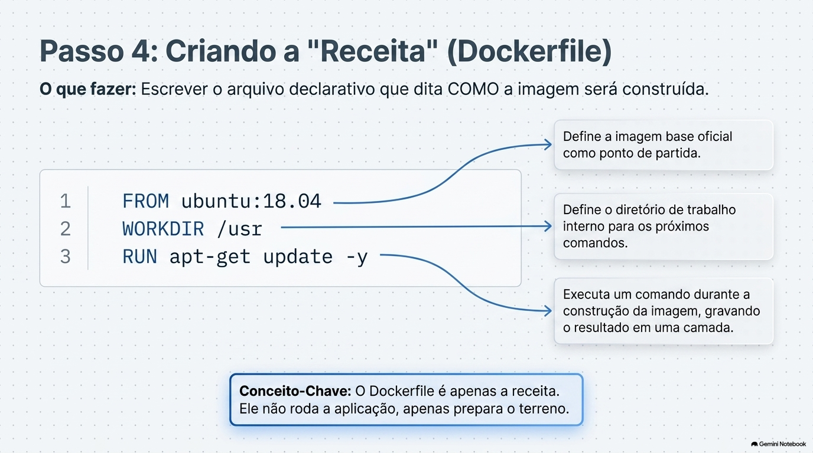

O Dockerfile mínimo da imagem acima:

```dockerfile
FROM ubuntu:18.04            # imagem BASE: o ponto de partida pronto, baixado do Docker Hub
WORKDIR /usr                 # diretório de trabalho: os comandos seguintes rodam a partir daqui
RUN apt-get update -y        # executa um comando DURANTE o build; o -y responde "sim" às perguntas
RUN apt-get install nano -y  # cada RUN vira uma camada nova, gravada dentro da imagem
```

As instruções que resolvem 90% dos casos:

| Instrução | O que faz | Exemplo |
| --- | --- | --- |
| `FROM` | Define a **imagem base** — de onde você parte | `FROM node:22` |
| `WORKDIR` | Define o diretório de trabalho dentro da imagem; cria se não existir | `WORKDIR /app` |
| `COPY` | Copia arquivos **do seu computador** para dentro da imagem | `COPY . /app` |
| `RUN` | Executa um comando **na hora do build** e grava o resultado em uma camada | `RUN npm install` |
| `EXPOSE` | **Documenta** qual porta a aplicação usa (não publica nada sozinho) | `EXPOSE 8080` |
| `CMD` | O comando que roda **quando o container inicia** | `CMD ["npm", "start"]` |

Um Dockerfile realista, comentado linha a linha:

```dockerfile
FROM node:22          # parte de uma imagem que já vem com o Node 22 instalado
WORKDIR /app          # tudo daqui em diante acontece dentro de /app
COPY package*.json ./ # copia SÓ os arquivos de dependência primeiro...
RUN npm install       # ...para que o cache do Docker reaproveite esta camada
COPY . .              # agora sim, copia o resto do código-fonte
EXPOSE 8080           # documenta: esta aplicação escuta na porta 8080
CMD ["npm", "start"]  # ao iniciar o container, execute "npm start"
```

> 💡 **Por que copiar o `package.json` antes do código?** O Docker guarda cada instrução em uma
> camada e reaproveita as que não mudaram. Se o código mudou mas as dependências não, o `npm install`
> vem do cache — e o build que levava minutos passa a levar segundos.

> ⚠️ **`RUN` e `CMD` não são a mesma coisa.** O `RUN` acontece **uma vez, no build**, e o resultado
> fica gravado na imagem. O `CMD` acontece **toda vez que um container sobe**. Confundir os dois é o
> erro mais comum de quem está começando.

**Conceito-chave:** o Dockerfile é **apenas a receita**. Ele não roda a aplicação — só descreve como
preparar o terreno.

---

### I. Build — da receita à imagem

**O que vamos fazer:** transformar o Dockerfile em uma **imagem**: um pacote imutável com o código,
as bibliotecas, as dependências e as configurações — tudo o que a aplicação precisa para rodar.

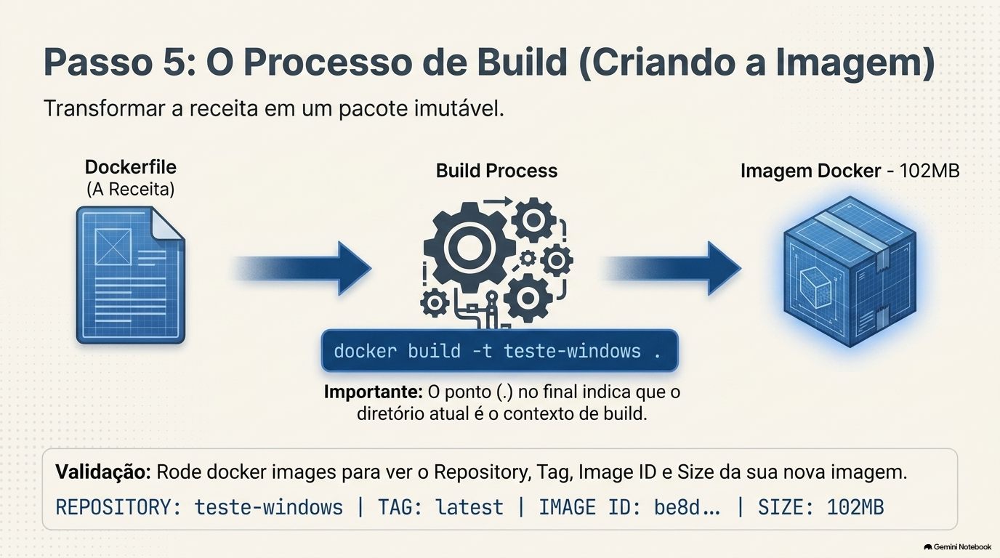

```bash
docker build -t teste-windows .  # constrói a imagem a partir do Dockerfile do diretório atual
```

Cada pedaço do comando:

```text
docker build
└── Lê o Dockerfile e executa as instruções, uma a uma

-t teste-windows
└── -t de "tag": dá um NOME à imagem. Sem isso ela nasce sem nome e só é
    identificável por um ID hexadecimal impossível de decorar

.
└── O contexto de build: qual pasta o Docker pode enxergar para copiar arquivos.
    O ponto significa "a pasta atual". É por isso que o COPY do Dockerfile
    consegue encontrar o seu código
```

**Como saber que deu certo:** a imagem aparece na listagem local.

```bash
docker images    # lista as imagens que existem nesta máquina
docker image ls  # exatamente o mesmo comando, na sintaxe mais nova
```

```text
REPOSITORY       TAG       IMAGE ID       CREATED          SIZE
teste-windows    latest    be8d1a2c3f45   3 seconds ago    102MB
```

| Coluna | O que significa |
| --- | --- |
| `REPOSITORY` | O nome que você deu com o `-t` |
| `TAG` | A versão. Se você não indicar nada, o Docker assume `latest` |
| `IMAGE ID` | Identificador único, gerado a partir do conteúdo da imagem |
| `SIZE` | Quanto a imagem ocupa em disco |

> 💡 Para versionar de verdade, coloque a versão na tag: `docker build -t minha-app:1.2.0 .`.
> Assim dá para voltar a uma versão anterior sem reconstruir nada.

---

### J. Run — da imagem ao container

**O que vamos fazer:** dar vida à imagem. A analogia que fecha a questão:

> **Imagem = o molde. Container = o objeto criado a partir do molde.**

De um mesmo molde saem quantos objetos você quiser, e nenhum deles altera o molde.

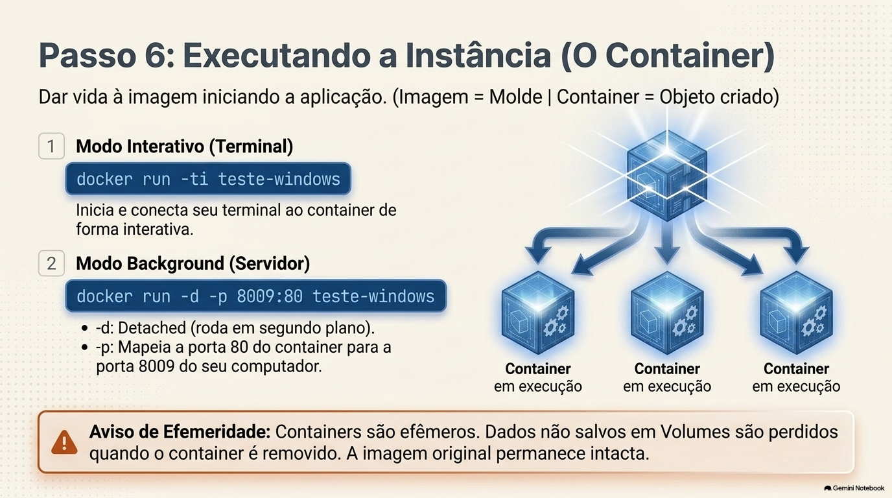

#### Modo interativo — entrar no container pelo terminal

```bash
docker run -ti ubuntu:18.04  # cria o container e conecta o seu terminal a ele
```

```text
-t
└── Aloca um terminal (TTY) dentro do container

-i
└── Mantém a entrada padrão (STDIN) aberta, para você poder digitar

-ti (juntos)
└── "quero um terminal e quero digitar nele" — é assim que se explora
    um container por dentro
```

Use quando quiser **investigar**: ver que arquivos existem lá dentro, testar um comando, entender por
que algo não funciona. Digite `exit` para sair.

#### Modo background — rodar como servidor

```bash
docker run -d -p 8009:80 minha-aplicacao  # sobe o container em segundo plano e publica a porta
```

```text
-d
└── "detached": roda em segundo plano e devolve o terminal para você.
    Sem o -d, o terminal fica preso mostrando os logs

-p 8009:80
└── Mapeamento de portas, sempre no formato PORTA_DO_HOST:PORTA_DO_CONTAINER.
    A aplicação escuta na 80 lá dentro; você acessa pela 8009 aqui fora
```

```text
Seu computador
     │  http://localhost:8009
     ▼
┌──────────────────────┐
│      Container       │
│   escutando na 80    │
└──────────────────────┘
```

> 💡 É exatamente o que a [etapa 9](#9-subir-o-projeto-bia) faz com `3001:8080` — a aplicação BIA
> escuta na `8080` dentro do container e responde na `3001` do seu navegador. O número da **esquerda
> é sempre o host**; o da **direita, o container**. A seção
> [Entendendo o mapeamento de portas](#entendendo-o-mapeamento-de-portas) detalha esse caso.

#### Gerenciando containers em execução

```bash
docker ps                    # lista os containers RODANDO agora
docker ps -a                 # lista TODOS, inclusive os parados (-a de "all")
docker logs <nome-ou-id>     # mostra o que o container imprimiu no terminal
docker logs -f <nome-ou-id>  # o mesmo, em tempo real (-f de "follow"; saia com Ctrl+C)
docker exec -ti <nome> bash  # abre um terminal DENTRO de um container que já está rodando
docker stop <nome-ou-id>     # para o container com delicadeza
docker rm <nome-ou-id>       # remove o container parado
```

| Comando | Quando usar |
| --- | --- |
| `docker ps` | "Está no ar?" |
| `docker ps -a` | "Subiu e morreu?" — o container que falhou aparece aqui, com o código de saída |
| `docker logs -f` | "Por que não funciona?" — a resposta quase sempre está aqui |
| `docker exec -ti <nome> bash` | "Como está lá dentro?" — entra no container **sem** derrubá-lo |
| `docker stop` / `docker rm` | Faxina: o `stop` desliga, o `rm` remove |

> ⚠️ **Container é efêmero.** O que a aplicação escreveu no sistema de arquivos do container **some**
> quando ele é removido. Para o dado sobreviver, ele precisa estar em um **volume** ou em um
> armazenamento externo. A imagem original, essa, nunca é alterada — sempre dá para criar um
> container novo e idêntico a partir dela. A [etapa 12](#12-provar-a-persistência-dos-dados) é
> justamente a prova prática disso.

---

### K. Compose — orquestrando vários serviços

**O que vamos fazer:** parar de subir container por container na mão. Uma aplicação real quase nunca
é um container só — a BIA são três: aplicação, banco e cache.

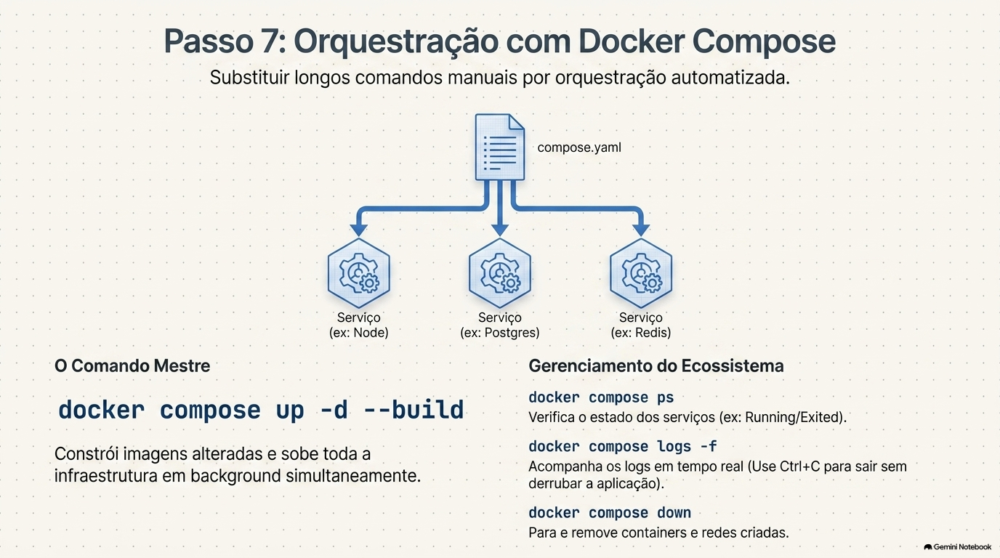

O **Docker Compose** lê um arquivo `compose.yaml` (ou `docker-compose.yml`) que descreve todos os
serviços, as portas, os volumes e a rede entre eles. Um comando sobe o conjunto inteiro.

```text
Projeto
│
├── Dockerfile        <- COMO construir a imagem da sua aplicação
└── compose.yaml      <- COMO os serviços sobem e conversam entre si
```

```bash
docker compose build             # apenas constrói as imagens definidas no compose.yaml
docker compose up                # cria e inicia os containers, prendendo o terminal nos logs
docker compose up -d             # o mesmo, em segundo plano (-d de "detached")
docker compose up -d --build     # reconstrói as imagens ANTES de subir, em segundo plano
docker compose ps                # mostra o estado dos serviços deste projeto
docker compose logs -f           # acompanha os logs de todos os serviços (Ctrl+C sai sem derrubar)
docker compose logs -f server    # acompanha os logs de UM serviço específico
docker compose exec server bash  # abre um terminal dentro do serviço "server"
docker compose down              # para e remove os containers e a rede criada
docker compose down -v           # o mesmo, e TAMBÉM apaga os volumes nomeados
```

| Comando | O que faz | Quando usar |
| --- | --- | --- |
| `up -d` | Sobe tudo em segundo plano | Rotina do dia a dia |
| `up -d --build` | Reconstrói as imagens e sobe | Depois de mexer no `Dockerfile` ou em algo que entra na imagem |
| `ps` | Estado dos serviços: `Up`, `Exited`, `Created` | Primeira coisa a rodar quando algo não responde |
| `logs -f` | Logs em tempo real | Para investigar erro de aplicação |
| `exec <serviço> bash` | Terminal dentro de um serviço no ar | Rodar migrations, inspecionar o banco |
| `down` | Para e remove containers e rede | Encerrar o trabalho do dia |
| `down -v` | O mesmo, **e apaga os volumes** | Só quando você **quer mesmo** zerar os dados |

> ⚠️ **O `-v` do `down` é a armadilha mais cara deste documento.** O `docker compose down` preserva
> os volumes — os dados do banco sobrevivem e voltam no próximo `up`. O `docker compose down -v`
> apaga os volumes junto: o banco volta vazio e as migrations precisam ser rodadas de novo. É
> literalmente a linha "Os dados sumiram depois de reiniciar" da tabela de
> [Solução de problemas](#-solução-de-problemas).

> 💡 A [etapa 8](#8-smoke-test-do-docker-compose) usa o Compose em um teste mínimo antes de encarar o
> projeto real, e a [etapa 10](#10-rodar-as-migrations-do-banco) usa o `exec` para criar o schema do
> banco dentro do container que já estava no ar.

---

### L. Onde ficam as imagens

**O que vamos entender:** uma dúvida que aparece assim que você tem mais de um projeto — as imagens
ficam guardadas dentro da pasta do projeto?

**Não.** A pasta do projeto guarda a *receita*; a imagem construída mora em um repositório central,
dentro do Docker Engine da sua máquina.

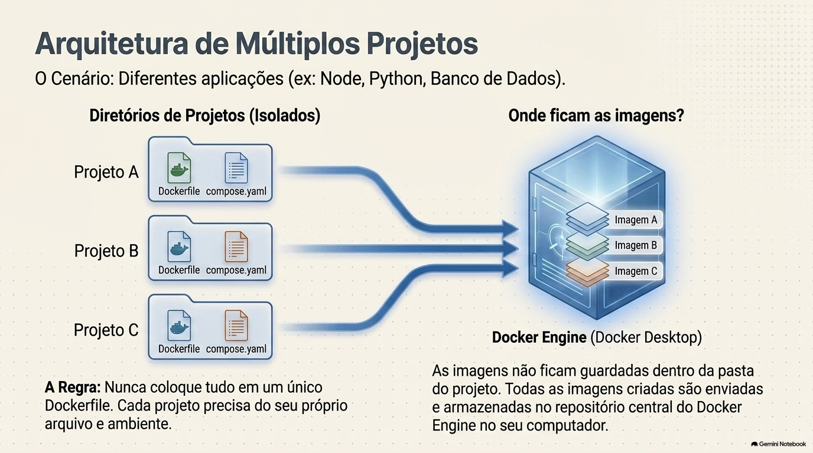

```text
Projeto A            Projeto B            Projeto C
├── Dockerfile       ├── Dockerfile       ├── Dockerfile
└── compose.yaml     └── compose.yaml     └── compose.yaml
      │                    │                    │
      └────────────────────┴────────────────────┘
                           │  docker build
                           ▼
                 Docker Engine (Docker Desktop)
                 ├── Imagem projeto-a
                 ├── Imagem projeto-b
                 ├── Imagem projeto-c
                 ├── Imagem postgres:17.1
                 └── Imagem valkey:8.1-alpine
```

**A regra:** cada projeto com finalidade diferente tem o **seu próprio Dockerfile**. Um projeto em
Node, um em Python e um que é banco + API não cabem em uma receita só — e nem deveriam. Cada
Dockerfile gera a sua imagem, e todas convivem no mesmo Docker Engine.

```bash
docker images  # comprova: todas as imagens da máquina, de todos os projetos, em uma lista só
```

> 💡 É por isso que a captura do Docker Desktop na seção de
> [Pré-requisitos](#-pré-requisitos) mostra, lado a lado, `bia-server`, `postgres`, `valkey`, `nginx`
> e `hello-world`: são imagens de origens diferentes, todas no mesmo repositório local.

---

### M. Rodar o Docker sem sudo

**O que vamos fazer:** eliminar o `Permission denied` que aparece ao usar o Docker no Linux sem
privilégio — sem precisar escrever `sudo` em cada comando.

O erro:

```text
permission denied while trying to connect to the Docker daemon socket
```

Ele acontece porque o Docker conversa por um *socket* que, por padrão, pertence ao grupo `docker`.
Se o seu usuário não está nesse grupo, o acesso é negado. A solução é entrar no grupo:

```bash
sudo usermod -aG docker $USER  # adiciona o usuário atual ao grupo docker; -aG = "append to Group"
newgrp docker                  # aplica o novo grupo à sessão atual, sem precisar deslogar
groups                         # lista os grupos do usuário — "docker" precisa aparecer
docker ps                      # teste final: tem que funcionar SEM sudo
```

| Comando | Por que é necessário |
| --- | --- |
| `sudo usermod -aG docker $USER` | Concede a permissão. O `-a` é essencial: **sem ele**, o `-G` *substitui* todos os seus grupos em vez de acrescentar um |
| `newgrp docker` | A associação a grupos só é lida no login. Este comando aplica a mudança agora |
| `groups` | Confirma que a permissão foi concedida de fato |
| `docker ps` | Confirma que ela funciona na prática |

**Como saber que deu certo:** o `docker ps` responde a listagem — mesmo vazia — em vez do erro de
permissão.

```text
$ groups
rafael sudo docker

$ docker ps
CONTAINER ID   IMAGE   COMMAND   CREATED   STATUS   PORTS   NAMES
```

> 💡 Se ainda falhar, encerre a sessão e entre de novo — ou, em último caso, `sudo reboot`.
> Normalmente **não** é preciso reiniciar o serviço do Docker.

> ⚠️ Neste laboratório o Docker vem do **Docker Desktop no Windows**, integrado ao WSL 2 pela
> [etapa 7](#7-integrar-o-docker-desktop-ao-wsl-2) — o que já resolve a permissão. Esta seção vale
> para uma instalação nativa do Docker Engine em Linux.

---

### N. Limpeza do ambiente

**O que vamos fazer:** recuperar espaço em disco. Builds repetidos deixam para trás imagens órfãs e
cache — em máquinas modestas, isso vira gigabytes rapidamente.

Antes de apagar qualquer coisa, tire a radiografia:

```bash
docker system df  # quanto ocupam imagens, containers, volumes e cache de build
```

```text
TYPE            TOTAL     ACTIVE    SIZE      RECLAIMABLE
Images          12        3         6.2GB     4.1GB (66%)
Containers      5         3         120MB     40MB (33%)
Local Volumes   4         1         890MB     620MB (69%)
Build Cache     38        0         2.4GB     2.4GB
```

A coluna `RECLAIMABLE` diz quanto dá para recuperar — e evita limpar o que não precisava ser limpo.

```bash
docker image prune          # remove imagens "penduradas" (sem tag, sobras de builds)
docker image prune -a       # remove TODAS as imagens não usadas por algum container
docker image prune -a -f    # o mesmo, sem pedir confirmação (-f de "force")
docker builder prune -f     # limpa o cache de build não utilizado
docker builder prune -a -f  # limpeza agressiva do cache
docker container prune -f   # remove todos os containers parados
docker volume ls            # LISTA os volumes — sempre antes de apagar qualquer um
docker volume rm <nome>     # remove um volume específico, escolhido por você
docker volume prune -f      # remove todos os volumes não utilizados
```

| Comando | Risco | O que você perde |
| --- | :-: | --- |
| `docker builder prune -f` | 🟢 Baixo | Só cache — o próximo build fica mais lento, nada além disso |
| `docker container prune -f` | 🟢 Baixo | Containers parados. Os dados em volume continuam lá |
| `docker image prune` | 🟢 Baixo | Imagens sem tag, que já eram lixo |
| `docker image prune -a` | 🟡 Médio | Imagens que você teria de baixar ou reconstruir depois |
| `docker volume prune -f` | 🔴 **Alto** | **Dados.** Bancos de dados, uploads, tudo que era persistente |

> ⚠️ **A imagem pode ser refeita; o dado, não.** Uma imagem apagada por engano volta com um
> `docker build` ou um `docker pull`. Um volume apagado por engano leva junto o banco de dados — e
> não há desfazer. **Nunca** rode `docker volume prune` sem antes conferir o `docker volume ls`.

**Como saber que deu certo:** rode `docker system df` de novo e compare a coluna `RECLAIMABLE`.

---

### O. O fluxo mental completo

Se você guardar uma única coisa deste apêndice, que seja esta sequência.

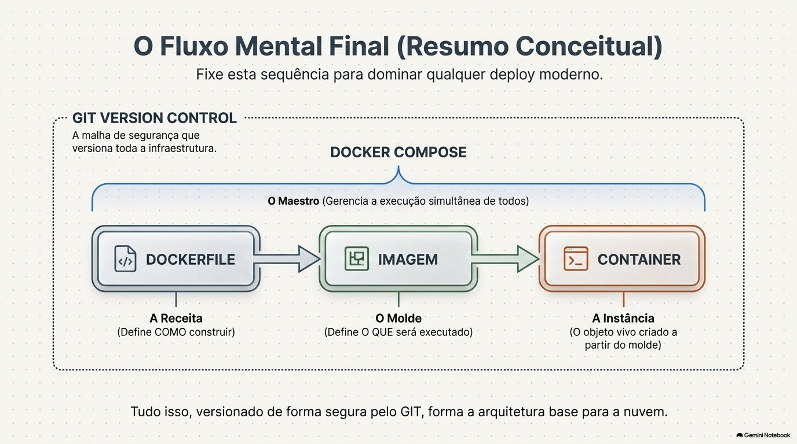

```text
Dockerfile
    │  docker build      "COMO construir"
    ▼
Imagem
    │  docker run        "O QUE será executado"
    ▼
Container
    │  docker compose    "quem sobe junto com quem"
    ▼
Aplicação rodando
```

| Peça | Analogia | Papel | O que a produz |
| --- | --- | --- | --- |
| **Dockerfile** | A receita | Define **como** construir | você escreve |
| **Imagem** | O molde | Define **o que** será executado | `docker build` |
| **Container** | A instância | O objeto vivo, criado a partir do molde | `docker run` |
| **Compose** | O maestro | Gerencia vários containers juntos | `docker compose up` |

E, envolvendo tudo isso, o **Git**: a malha de segurança que versiona não só o código, mas também o
`Dockerfile` e o `compose.yaml` — ou seja, **a própria infraestrutura**.

> **Dockerfile → constrói a Imagem → a Imagem cria o Container → o Compose orquestra os Containers.**
> Tudo isso, versionado pelo Git, forma a arquitetura base para a nuvem.

---

### P. Checklist de validação

**O que vamos fazer:** cinco comandos que confirmam que o ambiente inteiro está de pé. Se todos
responderem como esperado, Git e Docker estão prontos.

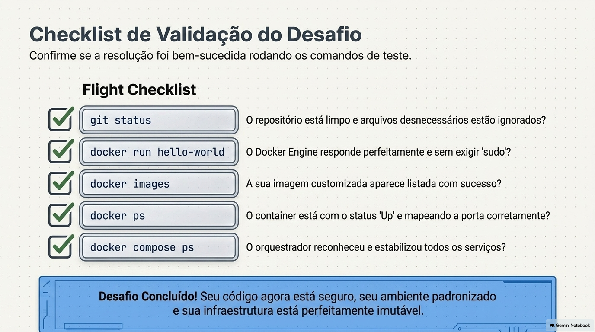

```bash
git status              # 1. a árvore de trabalho está limpa?
docker run hello-world  # 2. o engine responde? (baixa a imagem se não existir, roda e sai)
docker images           # 3. as imagens estão registradas?
docker ps               # 4. o container está de pé, com a porta publicada?
docker compose ps       # 5. o Compose enxerga todos os serviços do projeto?
```

| # | Comando | O que confirma | Resposta esperada |
| :-: | --- | --- | --- |
| 1 | `git status` | O repositório está limpo e o `.gitignore` funciona | `nothing to commit, working tree clean` |
| 2 | `docker run hello-world` | O Docker Engine responde — e sem exigir `sudo` | `Hello from Docker!` |
| 3 | `docker images` | A sua imagem foi construída e está registrada | A imagem aparece com `REPOSITORY`, `TAG` e `SIZE` |
| 4 | `docker ps` | O container está no ar e a porta está mapeada | `STATUS` em `Up` e a coluna `PORTS` preenchida |
| 5 | `docker compose ps` | O orquestrador reconheceu todos os serviços | Todos os serviços com estado `Up` |

O `docker run hello-world` merece uma explicação à parte, porque demonstra o ciclo inteiro em um
comando só: o Docker procura a imagem `hello-world` na máquina; **não encontra**; baixa do Docker
Hub; cria um container a partir dela; executa; imprime a mensagem; e o container encerra. É o
[smoke test](#8-smoke-test-do-docker-compose) mais barato que existe.

**Se os cinco passarem:** o código está versionado, o ambiente está padronizado e a infraestrutura é
reproduzível — que é exatamente o ponto de partida das 22 etapas deste desafio.

---

## 📚 Créditos e referências

- **Formação AWS 5.0** — Prof. Henrylle Maia
- Projeto BIA — <https://github.com/henrylle/bia>
- [WSL — documentação oficial da Microsoft](https://learn.microsoft.com/windows/wsl/)
- [Docker Desktop — WSL 2 integration](https://docs.docker.com/desktop/features/wsl/)
- [AWS Systems Manager — Session Manager](https://docs.aws.amazon.com/systems-manager/latest/userguide/session-manager.html)
- [Amazon RDS for PostgreSQL](https://docs.aws.amazon.com/AmazonRDS/latest/UserGuide/CHAP_PostgreSQL.html)
- [AWS Budgets](https://docs.aws.amazon.com/cost-management/latest/userguide/budgets-managing-costs.html)

---

<p align="center">
  <sub>Os nomes, e-mails, endpoints e caminhos de usuário deste documento são <strong>placeholders</strong>. Substitua-os pelos seus ao reproduzir o passo a passo.</sub>
</p>
